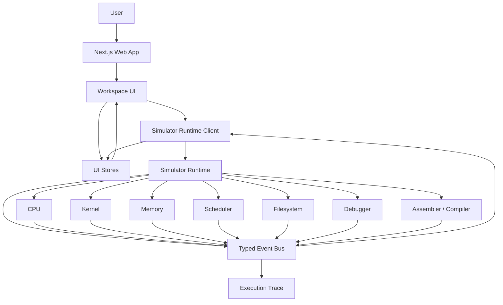
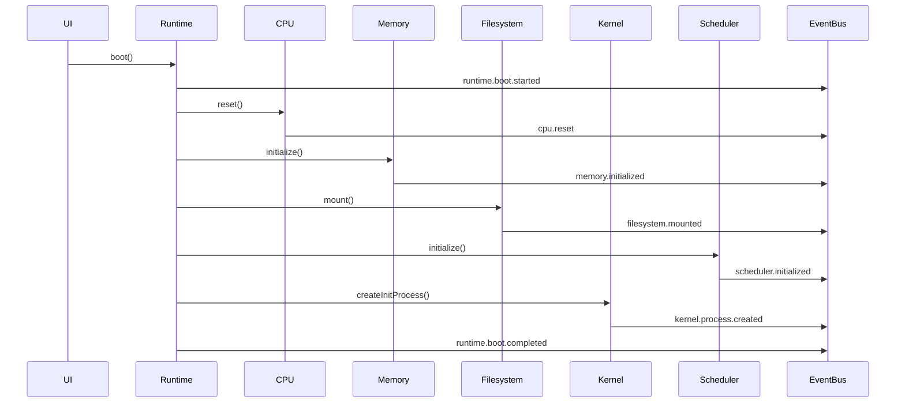
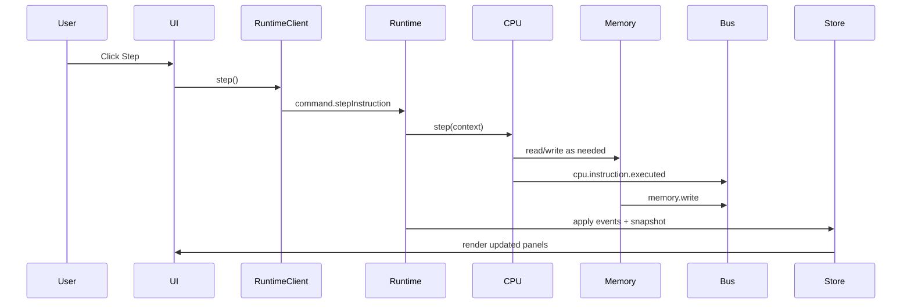
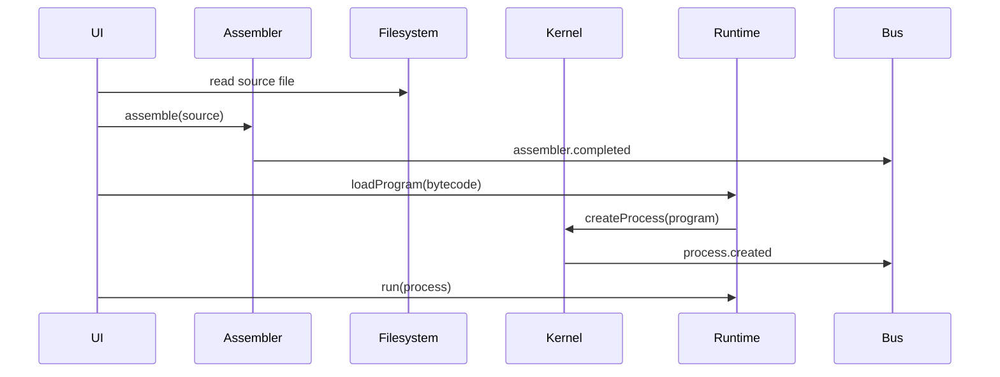

# NovaOS — System Architecture

**Document:** 02-system-architecture.md  
**Version:** 2.0  
**Status:** Execution-ready architecture specification  
**Primary consumer:** Claude Code / UltraCode multi-agent implementation team  

---

## 1. Purpose

This document defines the technical architecture of NovaOS. It specifies the monorepo layout, package boundaries, runtime architecture, state model, event bus, dependency rules, extensibility mechanisms, error handling strategy, and implementation contracts that all agents must follow.

NovaOS is a browser-native operating systems laboratory. Its architecture must support deterministic simulation, rich visualization, debugging, replay, and modular extension.

The most important architectural rule is separation of concerns:

> The simulator core owns truth. The UI observes truth. The UI must never be the source of simulation truth.

---

## 2. Architectural Goals

NovaOS architecture must satisfy the following goals:

1. Deterministic simulation.
2. Clean package boundaries.
3. Replaceable subsystem implementations.
4. High testability.
5. UI and simulator decoupling.
6. Efficient visualization of high-frequency events.
7. Replayable execution traces.
8. Extensibility for future features such as paging, networking, multicore, and plugins.
9. Developer clarity for a large multi-agent implementation workflow.

---

## 3. Technology Stack

### 3.1 Application stack

- Next.js App Router
- React
- TypeScript strict mode
- Tailwind CSS
- shadcn/ui or equivalent primitives
- Monaco Editor
- Zustand for UI/application state
- Framer Motion for intentional educational animation
- Web Workers where simulation or compilation would block UI

### 3.2 Simulator stack

- Pure TypeScript packages
- No React imports in simulator packages
- No DOM dependencies in simulator packages
- Serializable state and events
- Seeded deterministic random utilities

### 3.3 Testing stack

- Vitest for unit and integration tests
- Playwright for end-to-end smoke tests
- Testing Library for React components
- Custom deterministic replay test harness

### 3.4 Tooling

- pnpm workspaces
- Turborepo or equivalent task runner
- ESLint
- Prettier
- TypeScript project references
- GitHub Actions

---

## 4. High-Level System View



---

## 5. Core Architectural Pattern

NovaOS uses a layered architecture:

```text
Presentation Layer
    React components, panels, editor, terminal, visualizations

Application Layer
    UI stores, commands, workspace orchestration, runtime client

Simulation Runtime Layer
    Boot orchestration, clock, event routing, snapshot management

Domain Layer
    CPU, memory, kernel, scheduler, filesystem, assembler, debugger

Shared Layer
    Types, events, errors, utilities, deterministic random, serialization
```

Dependency direction is strictly downward.

Presentation can depend on application and shared types. Domain packages must not depend on presentation.

---

## 6. Monorepo Structure

```text
novaos/
  apps/
    web/
      app/
      components/
      stores/
      workers/
      styles/
      public/

  packages/
    shared/
    events/
    simulator/
    cpu/
    memory/
    kernel/
    scheduler/
    filesystem/
    shell/
    assembler/
    compiler/
    debugger/
    terminal/
    ui/
    examples/
    testing/

  docs/
    architecture/
    product/
    guides/
    adr/

  scripts/
  tests/
```

### 6.1 Package purpose summary

| Package | Purpose |
|---|---|
| `shared` | Common primitives, branded types, result types, serialization helpers |
| `events` | Typed domain events and event bus contracts |
| `simulator` | Runtime orchestration, boot, ticking, snapshots, replay |
| `cpu` | Register file, instruction execution, flags, CPU exceptions |
| `memory` | RAM, memory regions, allocation, read/write validation |
| `kernel` | Processes, syscalls, interrupts, context switching |
| `scheduler` | Scheduling algorithms and shared scheduler interface |
| `filesystem` | Virtual filesystem, path resolution, file operations, persistence adapters |
| `shell` | Shell lexer, parser, command execution |
| `assembler` | Assembly parser, label resolver, bytecode emitter, source maps |
| `compiler` | Future Toy C compiler pipeline |
| `debugger` | Breakpoints, stepping, watches, snapshots, timeline integration |
| `terminal` | Terminal model and command I/O abstractions |
| `ui` | Reusable design-system components |
| `examples` | Example programs and tutorials |
| `testing` | Shared test fixtures, replay harnesses, simulator builders |

---

## 7. Dependency Rules

### 7.1 Allowed dependencies

```text
apps/web -> packages/ui
apps/web -> packages/simulator
apps/web -> packages/events
apps/web -> packages/shared

packages/simulator -> packages/cpu
packages/simulator -> packages/kernel
packages/simulator -> packages/memory
packages/simulator -> packages/scheduler
packages/simulator -> packages/filesystem
packages/simulator -> packages/debugger
packages/simulator -> packages/events
packages/simulator -> packages/shared

all domain packages -> packages/shared
all domain packages -> packages/events
```

### 7.2 Forbidden dependencies

```text
packages/cpu -> React
packages/memory -> React
packages/kernel -> React
packages/scheduler -> filesystem concrete implementation
packages/filesystem -> UI
packages/debugger -> DOM
packages/shared -> any domain package
```

### 7.3 Dependency graph requirement

The package graph must remain acyclic. CI should include a dependency check that fails when circular dependencies are introduced.

---

## 8. Runtime Architecture

The simulator runtime is responsible for coordinating domain packages.

```ts
export interface SimulatorRuntime {
  boot(options?: BootOptions): Promise<BootResult>;
  shutdown(): Promise<void>;
  loadProgram(program: ProgramImage): Promise<ProcessId>;
  run(options?: RunOptions): Promise<void>;
  pause(reason?: PauseReason): void;
  step(): StepResult;
  reset(): Promise<void>;
  getSnapshot(): SimulatorSnapshot;
  restoreSnapshot(snapshot: SimulatorSnapshot): void;
  subscribe(listener: EventListener<DomainEvent>): Unsubscribe;
}
```

The runtime must be deterministic. It should not call `Date.now()` or `Math.random()` directly. Time and randomness must be injected.

---

## 9. Simulation Clock

NovaOS uses a simulated clock rather than wall-clock time for domain behavior.

```ts
export interface SimulationClock {
  now(): SimTime;
  tick(cycles: number): SimTime;
  reset(): void;
}
```

Wall-clock time may influence animation pacing, but it must not alter domain outcomes.

---

## 10. Event-Driven Architecture

Every meaningful state transition emits a typed event.

Events are used for:

- UI updates
- timeline recording
- debugging
- replay
- tests
- educational explanations

### 10.1 Event structure

```ts
export interface DomainEvent<TType extends string = string, TPayload = unknown> {
  id: EventId;
  type: TType;
  timestamp: SimTime;
  sequence: number;
  source: EventSource;
  payload: TPayload;
  causationId?: EventId;
  correlationId?: CorrelationId;
}
```

### 10.2 Event categories

- CPU
- Memory
- Kernel
- Scheduler
- Filesystem
- Shell
- Assembler
- Compiler
- Debugger
- Runtime
- UICommand
- Error

### 10.3 Event examples

```ts
export type InstructionExecutedEvent = DomainEvent<
  'cpu.instruction.executed',
  {
    processId: ProcessId;
    pcBefore: Address;
    pcAfter: Address;
    opcode: Opcode;
    operands: Operand[];
    cycles: number;
  }
>;
```

```ts
export type MemoryWrittenEvent = DomainEvent<
  'memory.write',
  {
    processId?: ProcessId;
    address: Address;
    previousValue: Byte;
    nextValue: Byte;
    region: MemoryRegionKind;
  }
>;
```

### 10.4 Event bus contract

```ts
export interface EventBus {
  publish(event: DomainEvent): void;
  subscribe<T extends DomainEvent>(
    predicate: EventPredicate<T>,
    listener: EventListener<T>
  ): Unsubscribe;
  drain(): DomainEvent[];
}
```

Events should be serializable as JSON.

---

## 11. State Model

NovaOS has several kinds of state.

### 11.1 Simulation truth

Owned by simulator/domain packages:

- CPU registers
- RAM contents
- process table
- scheduler queues
- filesystem tree
- debugger breakpoints
- execution trace

### 11.2 UI state

Owned by web app stores:

- panel layout
- selected tab
- theme
- selected memory address
- selected process
- open editor tabs
- collapsed panels

### 11.3 Persisted user state

Stored in browser persistence:

- files
- examples copied by user
- layout preferences
- theme
- editor preferences

### 11.4 Derived visualization state

Computed from events and snapshots:

- recently changed memory cells
- register deltas
- current instruction highlight
- filtered timeline
- scheduler animation state

Derived state must be reproducible and disposable.

---

## 12. Snapshot and Replay Architecture

Snapshots are essential for debugging and time travel.

```ts
export interface SimulatorSnapshot {
  version: SnapshotVersion;
  clock: SimTime;
  sequence: number;
  cpu: CpuSnapshot;
  memory: MemorySnapshot;
  kernel: KernelSnapshot;
  filesystem: FileSystemSnapshot;
  scheduler: SchedulerSnapshot;
  debugger: DebuggerSnapshot;
}
```

The runtime should support:

- full snapshots
- delta snapshots in later versions
- trace replay from boot
- state comparison between two events

Replay rule:

> Replaying the same initial snapshot and same command/event inputs must produce the same resulting snapshot.

---

## 13. Worker Architecture

The MVP may run simulation on the main thread if performance is acceptable. The architecture should still support Web Workers.

Preferred future model:

```text
Main Thread
  React UI
  Monaco
  Visualization

Worker Thread
  Simulator runtime
  CPU execution
  Assembler/compiler
```

Communication occurs through typed messages:

```ts
export type RuntimeWorkerMessage =
  | { type: 'runtime.boot'; payload: BootOptions }
  | { type: 'runtime.run'; payload: RunOptions }
  | { type: 'runtime.pause' }
  | { type: 'runtime.step' }
  | { type: 'runtime.snapshot.request' };
```

Worker messages should follow the same domain contracts as the in-process runtime client.

---

## 14. Boot Architecture

Boot is a sequence of deterministic phases.



Boot must either complete successfully or fail with a structured diagnostic.

---

## 15. Command Architecture

User actions become commands. Commands are separate from events.

- Commands express intent.
- Events describe what happened.

Example:

```ts
export type RuntimeCommand =
  | { type: 'command.boot' }
  | { type: 'command.runProcess'; processId: ProcessId }
  | { type: 'command.pause' }
  | { type: 'command.stepInstruction' }
  | { type: 'command.setBreakpoint'; location: BreakpointLocation };
```

Commands may be rejected. Rejections should produce diagnostics but not corrupt state.

---

## 16. Error Model

NovaOS uses structured errors.

```ts
export interface NovaError {
  code: string;
  severity: 'info' | 'warning' | 'recoverable' | 'fatal';
  message: string;
  details?: unknown;
  cause?: unknown;
  userAction?: string;
}
```

### 16.1 Recoverable errors

Examples:

- invalid shell command
- file not found
- compile error
- breakpoint on missing line
- process not found

### 16.2 Domain faults

Examples:

- segmentation fault
- invalid opcode
- divide by zero
- stack overflow

Domain faults pause execution and emit fault events.

### 16.3 Fatal errors

Examples:

- corrupted process table
- impossible scheduler state
- snapshot version mismatch that cannot be migrated
- invariant violation in memory ownership

Fatal errors halt the simulator and expose diagnostics.

---

## 17. Package Contracts

### 17.1 CPU package

```ts
export interface Cpu {
  reset(): void;
  getSnapshot(): CpuSnapshot;
  restoreSnapshot(snapshot: CpuSnapshot): void;
  step(context: CpuExecutionContext): CpuStepResult;
}
```

CPU must not know about React, panels, terminal, or filesystem.

### 17.2 Memory package

```ts
export interface Memory {
  readByte(address: Address, actor?: MemoryActor): Byte;
  writeByte(address: Address, value: Byte, actor?: MemoryActor): void;
  allocate(request: AllocationRequest): AllocationResult;
  free(request: FreeRequest): FreeResult;
  getSnapshot(): MemorySnapshot;
}
```

### 17.3 Kernel package

```ts
export interface Kernel {
  createProcess(image: ProgramImage): Process;
  killProcess(pid: ProcessId, reason: ExitReason): void;
  handleSyscall(request: SyscallRequest): SyscallResult;
  handleInterrupt(interrupt: Interrupt): void;
  getProcessTable(): Process[];
}
```

### 17.4 Scheduler package

```ts
export interface SchedulerAlgorithm {
  readonly id: SchedulerAlgorithmId;
  readonly name: string;
  enqueue(process: Process): void;
  remove(pid: ProcessId): void;
  pickNext(context: SchedulingContext): ProcessId | null;
  getSnapshot(): SchedulerSnapshot;
}
```

### 17.5 Filesystem package

```ts
export interface FileSystem {
  resolve(path: PathLike, cwd?: DirectoryId): FsNode;
  readFile(path: PathLike): FileContent;
  writeFile(path: PathLike, content: FileContent): void;
  createFile(path: PathLike, content?: FileContent): FsFile;
  createDirectory(path: PathLike): FsDirectory;
  delete(path: PathLike, options?: DeleteOptions): void;
  getSnapshot(): FileSystemSnapshot;
}
```

### 17.6 Debugger package

```ts
export interface DebuggerController {
  setBreakpoint(location: BreakpointLocation): Breakpoint;
  removeBreakpoint(id: BreakpointId): void;
  shouldPause(context: DebugContext): PauseDecision;
  createSnapshot(reason: SnapshotReason): DebugSnapshot;
  evaluateWatch(expression: WatchExpression): WatchResult;
}
```

---

## 18. UI Architecture

The web app is organized around a workspace shell.

```text
apps/web/components/
  workspace/
    WorkspaceShell.tsx
    TopBar.tsx
    PanelGrid.tsx
    CommandPalette.tsx
  panels/
    FileExplorerPanel.tsx
    EditorPanel.tsx
    TerminalPanel.tsx
    RegisterPanel.tsx
    MemoryPanel.tsx
    ProcessPanel.tsx
    SchedulerPanel.tsx
    TimelinePanel.tsx
    InspectorPanel.tsx
```

UI panels should subscribe to stores, not directly to low-level domain packages.

---

## 19. Store Architecture

Recommended stores:

```text
layoutStore
editorStore
runtimeStore
selectionStore
timelineStore
preferencesStore
visualizationStore
```

### 19.1 Runtime store

The runtime store mirrors selected simulator state for rendering. It is not the source of truth.

```ts
export interface RuntimeStoreState {
  status: RuntimeStatus;
  latestSnapshot: SimulatorSnapshot | null;
  recentEvents: DomainEvent[];
  selectedProcessId?: ProcessId;
  selectedAddress?: Address;
}
```

---

## 20. Data Flow Examples

### 20.1 Step instruction



### 20.2 Compile and run



---

## 21. Persistence Architecture

Persistence is adapter-based.

```ts
export interface PersistenceAdapter<T> {
  load(): Promise<T | null>;
  save(value: T): Promise<void>;
  clear(): Promise<void>;
}
```

MVP adapters:

- LocalStorage for preferences
- IndexedDB for filesystem and traces if needed

Persistence must be versioned.

```ts
export interface PersistedDocument<T> {
  version: string;
  createdAt: string;
  updatedAt: string;
  data: T;
}
```

---

## 22. Serialization and Versioning

All snapshots, events, examples, and persisted files must include version information.

This allows migration as the project evolves.

```ts
export interface Versioned<T> {
  schemaVersion: string;
  data: T;
}
```

Avoid storing class instances in persisted state. Use plain data objects.

---

## 23. Extensibility Architecture

NovaOS should prepare for future plugins without implementing full plugins in MVP.

Extension points:

- Scheduler algorithms
- Memory allocators
- Shell commands
- Example programs
- Instruction handlers
- Filesystem providers
- Tutorial modules

Each extension point should use explicit registries.

```ts
export interface Registry<T> {
  register(item: T): void;
  get(id: string): T | undefined;
  list(): T[];
}
```

---

## 24. Security and Safety

NovaOS runs user-authored simulated programs. These programs must not execute as JavaScript.

Rules:

- Assembly and Toy C compile only to NovaOS bytecode.
- Bytecode executes only inside the VM interpreter.
- Do not use `eval` or `new Function` for user code.
- Terminal commands must not access host filesystem or network.
- Export/import formats must be validated.

---

## 25. Performance Architecture

Performance-sensitive areas:

- CPU execution loop
- Memory grid rendering
- Timeline rendering
- Monaco editor diagnostics
- Event processing
- Snapshotting

Strategies:

- Batch high-frequency events for UI.
- Preserve full event trace internally.
- Virtualize memory and timeline lists.
- Use selectors to avoid unnecessary React re-renders.
- Keep core simulation data structures efficient.
- Consider workers for long-running execution.

---

## 26. Testing Architecture

Testing layers:

1. Unit tests for domain logic.
2. Contract tests for package APIs.
3. Integration tests for runtime flows.
4. Replay tests for determinism.
5. UI component tests.
6. Playwright smoke tests.

### 26.1 Determinism test example

```ts
it('replays execution deterministically', () => {
  const initial = createInitialSnapshot();
  const commands = loadFixtureCommands('simple-loop');
  const first = runSimulation(initial, commands);
  const second = runSimulation(initial, commands);
  expect(second.snapshot).toEqual(first.snapshot);
  expect(second.events).toEqual(first.events);
});
```

---

## 27. Observability and Diagnostics

Even without a backend, NovaOS needs internal diagnostics.

Developer diagnostics panel should show:

- event count
- simulation speed
- render frequency
- snapshot size
- memory usage estimate
- package versions
- active feature flags

---

## 28. Feature Flags

Use feature flags for experimental systems.

Examples:

- `toyCCompiler`
- `timeTravelDebugger`
- `workerRuntime`
- `virtualNetworking`
- `paging`
- `pluginRegistry`

Feature flags should be typed and centralized.

---

## 29. Architecture Decision Records

Significant choices should be captured in `docs/adr`.

Initial ADRs:

1. Browser-only MVP.
2. TypeScript simulator core.
3. Event-driven simulation model.
4. Fixed-width bytecode for MVP.
5. Assembly-first MVP before Toy C.
6. Deterministic simulation clock.
7. UI stores mirror but do not own simulation truth.

---

## 30. Implementation Order

Recommended build order:

1. Shared types and event model.
2. CPU + memory minimal execution.
3. Simulator runtime boot/step.
4. Assembler for simple programs.
5. Kernel process model.
6. Scheduler.
7. Shell and filesystem.
8. Debugger breakpoints.
9. UI panels.
10. Timeline and replay.
11. Polish, tests, examples, docs.

---

## 31. Architectural Definition of Done

The architecture is implementation-ready when:

- Package boundaries are created.
- Dependency graph is acyclic.
- Shared event types exist.
- Runtime can boot and step a trivial program.
- Snapshots are serializable.
- UI reads from runtime client, not domain internals.
- Core APIs are documented.
- Determinism tests exist.
- CI enforces typecheck, lint, and tests.

---

## 32. Final Architecture Directive

Do not build NovaOS as a collection of panels glued together with shared mutable state.

Build it as a deterministic operating-system simulation engine with a professional visualization client layered on top.

Every package must have a clear reason to exist. Every event must describe a meaningful state transition. Every future subsystem should be possible because the architecture was designed deliberately from the beginning.
