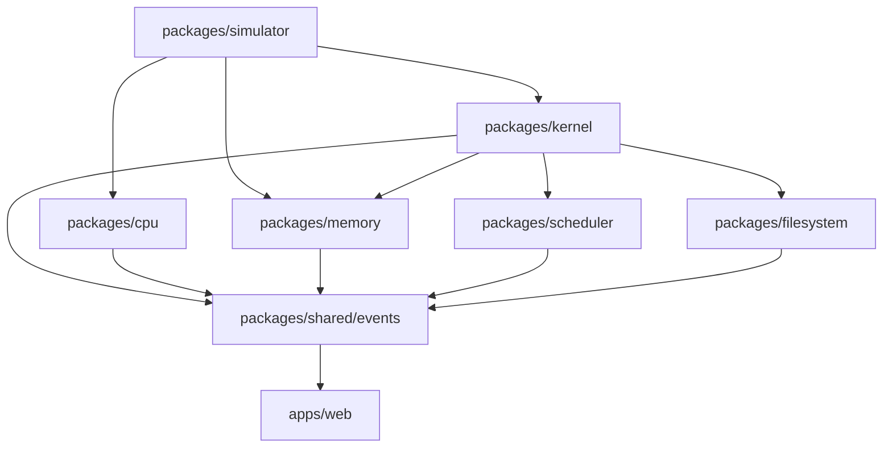
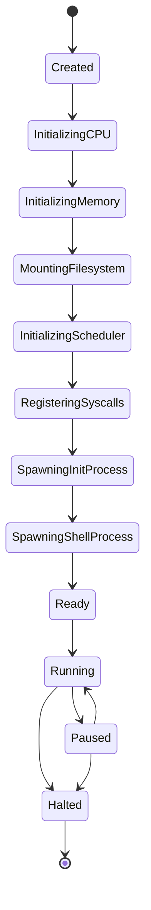
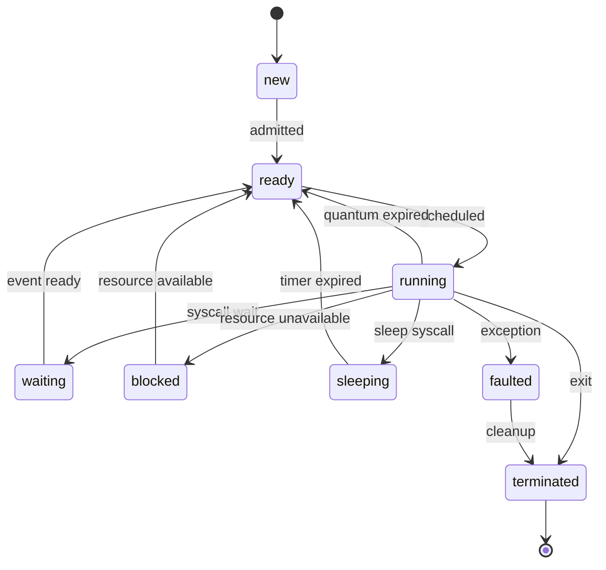
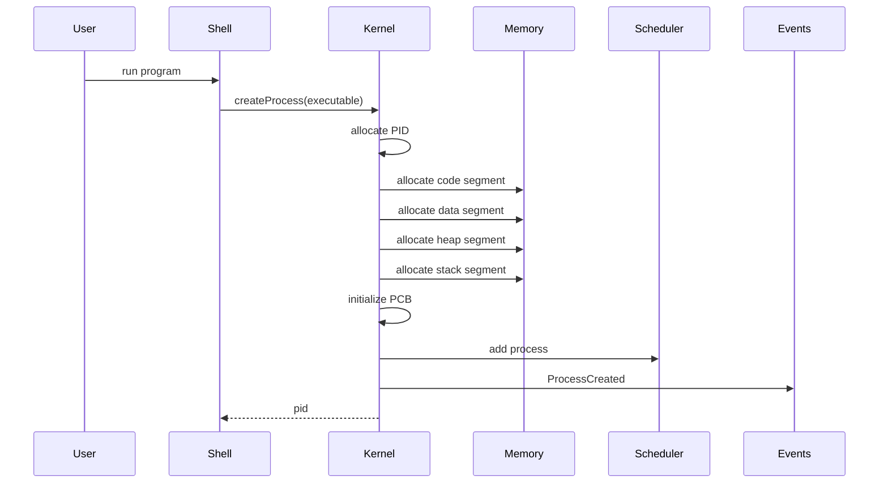
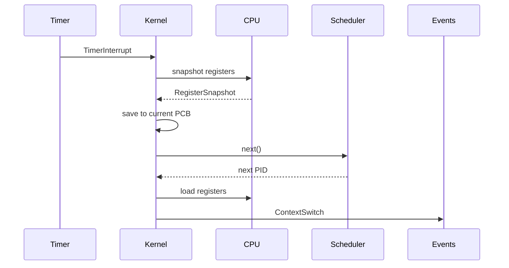

# NovaOS
# 04 - Kernel, Memory & Process Management

Version: 2.0

Status: Implementation Specification

Depends On:
- 01-product-requirements.md
- 02-system-architecture.md
- 03-virtual-machine.md

Primary Packages:
- `packages/kernel`
- `packages/memory`
- `packages/scheduler`
- `packages/simulator`
- `packages/shared`

---

# 1. Purpose

This document defines the NovaOS kernel, process model, scheduling model, syscall interface, interrupt model, memory manager, stack and heap behavior, and visualization contracts.

NovaOS is not trying to reproduce Linux or xv6 exactly. It is an educational operating system laboratory. The kernel should be realistic enough to teach real operating systems concepts, but intentionally simplified enough that students can inspect and understand the whole system.

The kernel must be:

- deterministic
- event-driven
- modular
- testable
- visualizable
- independent from React and browser UI code
- strict TypeScript
- safe against invalid simulated memory access
- designed for future paging, multicore execution, IPC, and plugins

The most important rule:

> The kernel owns operating system truth. The UI only observes kernel events and state snapshots.

---

# 2. Kernel Design Philosophy

The NovaOS kernel follows a small educational microkernel-inspired design.

The kernel coordinates services but should avoid becoming a monolith.

The kernel owns:

- boot lifecycle
- process lifecycle
- process table
- scheduler coordination
- syscall dispatch
- interrupt dispatch
- memory ownership boundaries
- kernel invariants
- runtime safety checks
- simulation state transitions

The kernel delegates:

- CPU instruction execution to `packages/cpu`
- raw memory reads/writes to `packages/memory`
- scheduling policies to `packages/scheduler`
- filesystem implementation to `packages/filesystem`
- compilation to `packages/compiler`
- UI visualization to `apps/web`
- timeline replay to `packages/debugger` / `packages/simulator`

The kernel must not import:

- React
- Next.js
- Tailwind
- shadcn components
- browser DOM APIs
- Monaco Editor
- UI stores

---

# 3. Architectural Placement



The simulator coordinates clock ticks and execution loops.

The kernel decides what process is running and what system services are available.

The CPU executes instructions for the selected process.

The memory package enforces addressable storage and bounds checks.

The scheduler chooses the next process using an interchangeable algorithm.

---

# 4. Package Boundaries

## `packages/kernel`

Responsibilities:

- boot sequence
- process table
- PCB lifecycle
- syscall dispatcher
- interrupt dispatcher
- context switch orchestration
- kernel state snapshots
- kernel event emission

Must not implement:

- raw byte array storage
- UI components
- compiler logic
- scheduler algorithms directly
- filesystem internals directly

---

## `packages/memory`

Responsibilities:

- byte-addressable RAM
- memory segments
- address validation
- first-fit allocator
- free list
- stack and heap helpers
- memory snapshots
- read/write events

Must not implement:

- process scheduling
- shell commands
- UI visualization
- kernel policy decisions

---

## `packages/scheduler`

Responsibilities:

- scheduler interface
- FIFO scheduler
- Round Robin scheduler
- Priority scheduler
- Shortest Job First scheduler
- Lottery scheduler
- deterministic scheduling utilities

Must not implement:

- process memory
- syscalls
- UI process table
- CPU instruction execution

---

# 5. Kernel Boot Lifecycle

The boot lifecycle should be explicit and visualizable.



Boot stages:

1. Create deterministic runtime context.
2. Initialize kernel state.
3. Initialize CPU service reference.
4. Initialize memory map.
5. Reserve kernel memory.
6. Mount initial filesystem.
7. Register scheduler implementation.
8. Register interrupt handlers.
9. Register syscall handlers.
10. Spawn `init`.
11. Spawn shell process.
12. Emit `KernelReady`.

Boot events:

- `KernelBootStarted`
- `KernelBootStageStarted`
- `KernelBootStageCompleted`
- `KernelBootCompleted`
- `KernelBootFailed`

The boot sequence must be replayable from events.

---

# 6. Kernel State

The kernel state is the authoritative operating system state.

```ts
export type KernelStatus =
  | "created"
  | "booting"
  | "ready"
  | "running"
  | "paused"
  | "halted"
  | "faulted";

export interface KernelState {
  status: KernelStatus;
  bootStage: BootStage | null;
  currentPid: ProcessId | null;
  processTable: ReadonlyMap<ProcessId, ProcessControlBlock>;
  schedulerState: SchedulerSnapshot;
  syscallTable: SyscallTableSnapshot;
  interruptTable: InterruptTableSnapshot;
  memoryOwnership: MemoryOwnershipTable;
  uptimeTicks: number;
  lastFault: KernelFault | null;
}
```

Kernel state must be serializable.

Avoid storing functions inside snapshots.

Use explicit service registries for runtime behavior and plain data for snapshots.

---

# 7. Process Model

A process is an executing program with isolated simulated resources.

A process owns:

- PID
- parent PID
- process state
- register snapshot
- memory map
- open file descriptors
- priority
- scheduling metadata
- CPU time accounting
- exit code
- diagnostic history

A process does not own:

- global RAM implementation
- scheduler implementation
- filesystem implementation
- UI rendering

---

# 8. Process States

```ts
export type ProcessState =
  | "new"
  | "ready"
  | "running"
  | "waiting"
  | "blocked"
  | "sleeping"
  | "terminated"
  | "faulted";
```

State transition graph:



All process transitions must emit a `ProcessStateChanged` event.

Invalid transitions must fail loudly in development and produce a recoverable kernel diagnostic in production simulation mode.

---

# 9. Process Control Block

```ts
export interface ProcessControlBlock {
  pid: ProcessId;
  parentPid: ProcessId | null;
  name: string;
  state: ProcessState;
  priority: number;
  registers: RegisterSnapshot;
  memoryMap: ProcessMemoryMap;
  openFiles: ReadonlyMap<FileDescriptor, OpenFileDescription>;
  scheduling: ProcessSchedulingMetadata;
  accounting: ProcessAccounting;
  createdAtTick: number;
  updatedAtTick: number;
  exitCode: number | null;
  fault: ProcessFault | null;
}
```

Supporting types:

```ts
export interface ProcessAccounting {
  cpuTicksUsed: number;
  instructionsExecuted: number;
  syscallsInvoked: number;
  contextSwitches: number;
  bytesAllocated: number;
  bytesFreed: number;
}

export interface ProcessSchedulingMetadata {
  quantumRemaining: number;
  lastScheduledAtTick: number | null;
  estimatedBurstTicks: number | null;
  lotteryTickets: number;
}

export interface ProcessMemoryMap {
  code: MemorySegment;
  data: MemorySegment;
  heap: MemorySegment;
  stack: MemorySegment;
}
```

The PCB must be small enough to snapshot frequently.

Large memory contents should not be duplicated into every PCB.

The PCB references memory segments; memory snapshots live in the memory package.

---

# 10. PID Allocation

PID allocation must be deterministic.

```ts
export interface PidAllocator {
  next(): ProcessId;
  release(pid: ProcessId): void;
  snapshot(): PidAllocatorSnapshot;
}
```

Version 1 strategy:

- Start at PID 1.
- Increment monotonically.
- Do not reuse PIDs in the same boot session.
- PID 0 is reserved for kernel.
- PID 1 is conventionally `init`.

Future:

- optional PID reuse with generation counters
- process namespaces
- parent-child process trees

---

# 11. Process Creation Flow

Creating a process requires both kernel and memory work.



Algorithm:

1. Validate executable format.
2. Allocate PID.
3. Reserve code segment.
4. Write bytecode into code segment.
5. Reserve data segment.
6. Create heap segment.
7. Create stack segment.
8. Initialize PC to program entry.
9. Initialize SP to stack top.
10. Initialize FLAGS.
11. Create PCB in `new` state.
12. Transition to `ready`.
13. Add to scheduler.
14. Emit `ProcessCreated`.
15. Return PID.

Failure behavior:

- If memory allocation fails, release all partially allocated segments.
- If executable validation fails, no PID should be consumed unless the implementation deliberately records failed creations.
- If scheduler registration fails, process must be cleaned up.

---

# 12. Process Termination Flow

Termination can occur through:

- `exit` syscall
- program `HALT`
- uncaught runtime exception
- user kill command
- parent process cleanup
- fatal kernel shutdown

Termination algorithm:

1. Transition process to `terminated` or `faulted`.
2. Remove from scheduler.
3. Close open file descriptors.
4. Free process-owned memory.
5. Record exit code or fault.
6. Emit `ProcessTerminated`.
7. If parent is waiting, unblock parent.
8. If current process terminated, schedule next process.

Terminated processes may remain visible as historical records until cleaned by a future `reap` behavior.

---

# 13. Context Switching

A context switch transfers CPU execution from one process to another.

Context switching is one of the most important educational visualizations in NovaOS.

A context switch must be decomposed into visible stages:

1. Save current process CPU registers.
2. Update current process state.
3. Ask scheduler for next process.
4. Load next process CPU registers.
5. Update next process state.
6. Emit `ContextSwitch`.
7. Resume execution.



Context switch event payload:

```ts
export interface ContextSwitchEvent {
  previousPid: ProcessId | null;
  nextPid: ProcessId | null;
  reason: ContextSwitchReason;
  savedRegisters?: RegisterSnapshot;
  loadedRegisters?: RegisterSnapshot;
  tick: number;
}
```

Reasons:

```ts
export type ContextSwitchReason =
  | "boot"
  | "timer-quantum-expired"
  | "process-blocked"
  | "process-exited"
  | "process-faulted"
  | "manual-step"
  | "scheduler-change";
```

---

# 14. Scheduler Interface

The kernel depends only on a scheduler interface.

```ts
export interface Scheduler {
  readonly id: SchedulerId;
  readonly name: string;

  add(process: ProcessControlBlock): SchedulerResult<void>;
  remove(pid: ProcessId): SchedulerResult<void>;
  update(process: ProcessControlBlock): SchedulerResult<void>;
  next(context: SchedulingContext): SchedulerResult<ProcessId | null>;
  snapshot(): SchedulerSnapshot;
  restore(snapshot: SchedulerSnapshot): SchedulerResult<void>;
}
```

Scheduling context:

```ts
export interface SchedulingContext {
  currentPid: ProcessId | null;
  processes: ReadonlyMap<ProcessId, ProcessControlBlock>;
  tick: number;
  random: DeterministicRandom;
}
```

Schedulers must not mutate PCBs directly.

They return decisions.

The kernel applies transitions.

---

# 15. Required Scheduling Algorithms

## First Come First Served

Behavior:

- Processes run in admission order.
- No preemption unless process exits, blocks, or faults.

Educational use:

- demonstrates convoy effect
- simple baseline

## Round Robin

Behavior:

- Each process receives fixed quantum.
- Quantum expiration triggers timer interrupt and context switch.

Config:

```ts
export interface RoundRobinConfig {
  quantumTicks: number;
}
```

Educational use:

- demonstrates fairness
- shows cost of context switches

## Priority Scheduling

Behavior:

- Highest priority ready process runs first.
- Ties are deterministic by admission sequence.

Config:

```ts
export interface PriorityConfig {
  preemptive: boolean;
  agingEnabled: boolean;
}
```

Educational use:

- demonstrates starvation and aging

## Shortest Job First

Behavior:

- Select ready process with smallest estimated burst.
- Estimates may be user-provided or derived from historical execution.

Educational use:

- demonstrates optimal average waiting time and prediction difficulty

## Lottery Scheduling

Behavior:

- Each ready process owns a deterministic number of tickets.
- Scheduler uses seeded PRNG to select winner.

Educational use:

- demonstrates probabilistic fairness
- requires deterministic replay via seeded randomness

---

# 16. Scheduler Testing Contract

Every scheduler implementation must pass the same shared tests:

- empty queue returns null
- single ready process is selected
- terminated process is never selected
- blocked process is never selected
- deterministic ordering with same input
- snapshot and restore preserve behavior
- removing process prevents future selection
- process updates affect scheduling decisions

Algorithm-specific tests:

- Round Robin rotates ready queue
- FIFO preserves admission order
- Priority selects highest priority
- SJF selects shortest estimated burst
- Lottery is deterministic with same seed

---

# 17. Memory Model Overview

NovaOS Version 1 uses a flat byte-addressable memory model.

Default RAM:

```text
64 KiB
```

Address type:

```ts
export type Address = Brand<number, "Address">;
export type Byte = Brand<number, "Byte">;
```

Memory is divided into segments.

```text
+-----------------------------+ 0x0000
| Kernel Reserved             |
+-----------------------------+
| Process Code Segments       |
+-----------------------------+
| Process Data Segments       |
+-----------------------------+
| Heap Regions                |
|                             |
+-----------------------------+
| Free Space                  |
|                             |
+-----------------------------+
| Stack Regions               |
+-----------------------------+ 0xFFFF
```

Version 1 uses physical simulated addresses.

Future versions may add virtual addresses, pages, and page tables.

---

# 18. Memory Segment Model

```ts
export type MemorySegmentKind =
  | "kernel"
  | "code"
  | "data"
  | "heap"
  | "stack"
  | "mmio"
  | "free";

export interface MemorySegment {
  id: SegmentId;
  ownerPid: ProcessId | null;
  kind: MemorySegmentKind;
  base: Address;
  size: number;
  permissions: MemoryPermissions;
  label: string;
}
```

Permissions:

```ts
export interface MemoryPermissions {
  read: boolean;
  write: boolean;
  execute: boolean;
}
```

Examples:

- Code: read + execute, no write after load.
- Data: read + write.
- Heap: read + write.
- Stack: read + write.
- Kernel: kernel-only access.

---

# 19. Memory Access Rules

Every memory access must be checked.

Checks:

1. Address is within RAM.
2. Address range does not overflow.
3. Segment exists for address.
4. Process owns segment or access is kernel-authorized.
5. Permission allows requested operation.
6. Alignment is valid if required by instruction.

Failure produces a memory fault.

```ts
export type MemoryFaultCode =
  | "out-of-bounds"
  | "permission-denied"
  | "unmapped-address"
  | "unaligned-access"
  | "kernel-access-denied";
```

Memory faults become process faults unless they occur inside kernel mode.

---

# 20. Memory API

```ts
export interface Memory {
  readByte(address: Address, context: MemoryAccessContext): MemoryResult<Byte>;
  writeByte(address: Address, value: Byte, context: MemoryAccessContext): MemoryResult<void>;

  readWord(address: Address, context: MemoryAccessContext): MemoryResult<number>;
  writeWord(address: Address, value: number, context: MemoryAccessContext): MemoryResult<void>;

  allocate(request: AllocationRequest): MemoryResult<MemorySegment>;
  free(segmentId: SegmentId, context: MemoryAccessContext): MemoryResult<void>;

  getSegment(address: Address): MemorySegment | null;
  snapshot(): MemorySnapshot;
  restore(snapshot: MemorySnapshot): MemoryResult<void>;
}
```

Access context:

```ts
export interface MemoryAccessContext {
  pid: ProcessId | null;
  mode: "kernel" | "user";
  operation: "read" | "write" | "execute";
  reason: string;
}
```

---

# 21. Allocation Strategy

Version 1 uses first-fit allocation.

First-fit algorithm:

1. Keep a free list sorted by base address.
2. Find first block with `size >= requestedSize`.
3. Allocate from the beginning of the block.
4. Shrink or remove the free block.
5. Insert allocated segment into segment table.
6. Emit `MemoryAllocated`.

Free algorithm:

1. Validate owner.
2. Remove allocated segment.
3. Insert free block.
4. Merge adjacent free blocks.
5. Emit `MemoryFreed`.

Allocator events:

- `MemoryAllocated`
- `MemoryFreed`
- `MemoryCompacted` (future)
- `MemoryAllocationFailed`

Educational metadata:

- fragmentation percentage
- largest free block
- number of free blocks
- allocation owner

---

# 22. Stack Model

Each process receives a stack segment.

The stack grows downward.

```text
High Address
+------------------+
| stack base + size |
|                  |
| used stack        |
|                  |
| stack pointer --> |
| free stack        |
+------------------+
Low Address
```

Stack operations:

- `pushByte`
- `pushWord`
- `popByte`
- `popWord`
- `createFrame`
- `destroyFrame`

Stack overflow occurs when SP moves below stack base.

Stack underflow occurs when SP moves above stack top.

Every push/pop must emit events when debug tracing is enabled.

---

# 23. Heap Model

Each process receives a heap segment.

The heap grows upward within its segment.

Version 1 may implement process heap using sub-allocations inside the process heap segment.

```ts
export interface HeapBlock {
  id: HeapBlockId;
  ownerPid: ProcessId;
  offset: number;
  size: number;
  free: boolean;
}
```

Heap operations exposed via syscalls:

- `malloc(size)`
- `free(ptr)`

Errors:

- invalid free
- double free
- out of memory
- free of non-owned pointer

Educational visualization:

- allocated blocks
- free blocks
- fragmentation
- ownership
- allocation timeline

---

# 24. Memory Protection

Memory protection is essential.

User processes may not:

- write to code after load
- access kernel memory
- access another process's memory
- execute non-executable segments
- read unmapped addresses
- write outside heap/stack/data

Violations emit:

- `MemoryAccessViolation`
- `ProcessFaulted`
- optionally `ExceptionThrown`

The simulator pauses automatically if configured to pause on memory fault.

---

# 25. Syscall Model

User programs access system services through syscalls.

Instruction flow:

```text
SYSCALL id
   ↓
CPU emits syscall interrupt
   ↓
Kernel receives interrupt
   ↓
Kernel validates syscall ID
   ↓
Kernel reads arguments from registers/stack
   ↓
Kernel invokes handler
   ↓
Kernel writes return value
   ↓
Execution resumes or process blocks/exits
```

Syscall handler interface:

```ts
export interface SyscallHandler {
  readonly id: SyscallId;
  readonly name: string;
  invoke(context: SyscallContext): SyscallResult;
}
```

Context:

```ts
export interface SyscallContext {
  pid: ProcessId;
  registers: RegisterSnapshot;
  kernel: KernelServiceAccess;
  memory: Memory;
  filesystem: Filesystem;
  tick: number;
}
```

Syscall result:

```ts
export type SyscallResult =
  | { kind: "return"; value: number }
  | { kind: "block"; reason: string }
  | { kind: "exit"; code: number }
  | { kind: "fault"; fault: ProcessFault };
```

---

# 26. Version 1 Syscall Table

| ID | Name | Description |
|---:|---|---|
| 0 | `print` | Print integer/string to terminal output |
| 1 | `read` | Read from file descriptor |
| 2 | `open` | Open file path |
| 3 | `close` | Close file descriptor |
| 4 | `exit` | Terminate current process |
| 5 | `sleep` | Block process for N ticks |
| 6 | `malloc` | Allocate heap memory |
| 7 | `free` | Free heap memory |
| 8 | `yield` | Voluntarily yield CPU |
| 9 | `time` | Return current simulated tick |

All syscall invocations emit `SyscallInvoked`.

All syscall completions emit `SyscallCompleted`.

Failures emit `SyscallFailed`.

---

# 27. Interrupt Model

Interrupts represent asynchronous or exceptional control flow.

Supported interrupts:

```ts
export type InterruptKind =
  | "timer"
  | "keyboard"
  | "syscall"
  | "breakpoint"
  | "exception"
  | "manual-pause";
```

Interrupt payload:

```ts
export interface Interrupt {
  id: InterruptId;
  kind: InterruptKind;
  source: string;
  priority: number;
  payload: unknown;
  tick: number;
}
```

Interrupt handling algorithm:

1. Receive interrupt.
2. Emit `InterruptRaised`.
3. Check interrupt enabled flag if applicable.
4. Save current process context.
5. Dispatch to handler.
6. Apply handler result.
7. Emit `InterruptHandled`.
8. Resume, pause, or context switch.

Timer interrupts drive preemptive scheduling.

Breakpoint interrupts drive debugger pause behavior.

Exception interrupts drive process fault behavior.

---

# 28. Kernel Faults

Kernel faults are more serious than process faults.

Process fault:

- caused by user program
- affects one process
- simulator may continue

Kernel fault:

- caused by broken invariant
- affects OS state
- simulator should halt or enter faulted mode

Kernel fault examples:

- missing PCB for current PID
- scheduler selects non-ready process
- duplicate PID
- memory ownership table mismatch
- syscall handler throws uncaught host exception
- impossible state transition

Kernel fault type:

```ts
export interface KernelFault {
  code: string;
  message: string;
  severity: "recoverable" | "fatal";
  tick: number;
  details?: Record<string, unknown>;
}
```

---

# 29. Event Contracts

Kernel events must be typed and serializable.

Important events:

```ts
export type KernelEvent =
  | KernelBootStartedEvent
  | KernelBootStageCompletedEvent
  | KernelBootCompletedEvent
  | ProcessCreatedEvent
  | ProcessStateChangedEvent
  | ProcessTerminatedEvent
  | ContextSwitchEvent
  | SyscallInvokedEvent
  | SyscallCompletedEvent
  | InterruptRaisedEvent
  | InterruptHandledEvent
  | KernelFaultEvent;
```

Memory events:

```ts
export type MemoryEvent =
  | MemoryReadEvent
  | MemoryWrittenEvent
  | MemoryAllocatedEvent
  | MemoryFreedEvent
  | MemoryAccessViolationEvent
  | StackPushedEvent
  | StackPoppedEvent
  | HeapBlockAllocatedEvent
  | HeapBlockFreedEvent;
```

Events must include:

- event ID
- sequence number
- simulated tick
- source package
- payload
- correlation ID where relevant

---

# 30. Visualization Contracts

The UI needs stable data contracts.

## Process table snapshot

```ts
export interface ProcessTableSnapshot {
  processes: ProcessSummary[];
  currentPid: ProcessId | null;
}

export interface ProcessSummary {
  pid: ProcessId;
  name: string;
  state: ProcessState;
  priority: number;
  cpuTicksUsed: number;
  memoryBytes: number;
  instructionsExecuted: number;
  currentInstructionAddress: Address | null;
}
```

## Memory map snapshot

```ts
export interface MemoryMapSnapshot {
  totalBytes: number;
  segments: MemorySegment[];
  freeBytes: number;
  usedBytes: number;
  fragmentation: FragmentationSummary;
}
```

## Scheduler snapshot

```ts
export interface SchedulerSnapshot {
  schedulerId: SchedulerId;
  algorithmName: string;
  queues: SchedulerQueueSnapshot[];
  currentPid: ProcessId | null;
  config: Record<string, unknown>;
}
```

These snapshots must be cheap enough to request during UI updates.

Large memory grids should use windowed range queries rather than full RAM copies.

---

# 31. Determinism Requirements

Kernel and memory behavior must be deterministic.

Given:

- same executable
- same filesystem
- same inputs
- same scheduler config
- same random seed
- same event sequence

the simulator must produce:

- same process states
- same memory writes
- same register values
- same scheduler decisions
- same event sequence

Forbidden:

- `Date.now()` inside deterministic logic
- `Math.random()` inside scheduler or kernel
- object iteration order where it affects behavior unless normalized
- async race conditions affecting simulation order

Use deterministic clock and seeded random utilities from shared runtime.

---

# 32. Snapshot and Replay

The kernel must support snapshot and restore.

Snapshot includes:

- kernel status
- process table
- scheduler snapshot
- syscall table metadata
- interrupt table metadata
- memory ownership table
- PID allocator state
- current PID
- uptime tick

Snapshot does not include:

- React state
- DOM references
- open browser handles
- functions
- non-serializable objects

Replay uses:

- initial snapshot
- deterministic input events
- deterministic scheduler
- deterministic clock

---

# 33. Testing Strategy

## Unit tests

Required for:

- PID allocator
- process state transitions
- context switch logic
- syscall dispatch
- interrupt dispatch
- memory read/write
- memory permissions
- allocator behavior
- stack overflow / underflow
- heap allocation / free
- each scheduler algorithm

## Integration tests

Required flows:

- boot kernel
- create process
- execute until exit
- timer interrupt triggers context switch
- syscall print writes output
- malloc/free updates heap
- invalid memory access faults process
- terminated process is removed from scheduler
- snapshot/restore preserves state

## Property-like tests

Useful for:

- allocator free-list merging
- scheduler determinism
- memory bounds checking
- state transition validity

## Golden tests

Useful for:

- event sequences
- context switch traces
- fault diagnostics

---

# 34. Performance Requirements

Target performance:

```text
Kernel boot: < 500 ms
Process creation: < 5 ms
Context switch: < 1 ms
Memory read/write: O(1)
Scheduler next(): O(n) acceptable for V1
Snapshot creation: < 16 ms for normal demos
Instruction stepping UI path: < 16 ms
```

The simulator should support at least:

- 100 processes in process table
- 64 KiB RAM default
- 1 MiB RAM optional
- 10,000 timeline events without unusable UI
- 100,000 simulated instructions per second in headless mode

Performance may be lower when educational animation is enabled.

---

# 35. Security and Safety

NovaOS executes simulated programs, not host machine programs.

Still, implementation must be careful.

Rules:

- never use `eval` for Toy C or assembly execution
- never execute generated JavaScript from user programs
- sanitize imported filesystem data
- validate snapshot schemas
- prevent runaway browser freezes with execution limits
- allow emergency pause/stop
- avoid unbounded memory growth in timeline
- protect against maliciously huge pasted programs

Resource limits:

```ts
export interface RuntimeLimits {
  maxInstructionsPerRun: number;
  maxProcesses: number;
  maxMemoryBytes: number;
  maxTimelineEvents: number;
  maxFileSizeBytes: number;
  maxOpenFilesPerProcess: number;
}
```

---

# 36. Implementation Order

Recommended order:

1. Shared branded types.
2. Memory core.
3. Memory segments.
4. First-fit allocator.
5. Register snapshot integration.
6. PCB type.
7. PID allocator.
8. Process state machine.
9. Scheduler interface.
10. FIFO scheduler.
11. Round Robin scheduler.
12. Kernel boot state.
13. Process creation.
14. Context switching.
15. Timer interrupts.
16. Syscall dispatcher.
17. `print` and `exit` syscalls.
18. `malloc` and `free` syscalls.
19. Memory protection faults.
20. Snapshot/restore.
21. Visualization snapshots.
22. Integration tests.

Do not build advanced syscalls before the basic process lifecycle works.

---

# 37. Agent Ownership Recommendations

Recommended agents from `08-agent-orchestration.md`:

- Agent 16: Memory Core
- Agent 17: Allocator
- Agent 18: Stack and Heap
- Agent 19: Kernel Core
- Agent 20: Process Manager
- Agent 21: Scheduler
- Agent 22: Syscall
- Agent 23: Interrupt
- Agent 39: Timeline and Replay
- Agent 48: Testing and QA

Suggested sequencing:

1. Memory Core + Shared Types
2. Allocator + Stack/Heap
3. Process Manager + Scheduler
4. Kernel Core + Interrupts
5. Syscalls
6. Snapshot/Replay
7. UI contracts and integration

---

# 38. Common Failure Modes

## Failure: Kernel becomes a god object

Mitigation:

Keep memory, scheduler, filesystem, and CPU logic outside the kernel.

## Failure: Scheduler mutates process state

Mitigation:

Schedulers return decisions. Kernel applies transitions.

## Failure: UI reads internal mutable maps

Mitigation:

Expose snapshots and events only.

## Failure: Memory faults are inconsistent

Mitigation:

All memory access goes through memory package access validation.

## Failure: Context switching is not visualizable

Mitigation:

Emit staged context switch events, not just final state.

## Failure: Deterministic replay breaks

Mitigation:

No wall-clock time or unseeded randomness in simulation logic.

---

# 39. Minimum Viable Kernel Demo

The first successful kernel demo should:

1. Boot NovaOS.
2. Spawn `init`.
3. Spawn shell process.
4. Create one user process from bytecode.
5. Execute a few instructions.
6. Invoke `print`.
7. Trigger timer interrupt.
8. Context switch.
9. Exit process.
10. Show process termination in timeline.

Example user-visible output:

```text
NovaOS boot complete.
Running hello.asm...
15
Process 2 exited with code 0.
```

Expected visualization:

- boot stages complete
- process table shows PID 1 and PID 2
- scheduler queue updates
- register viewer changes
- memory viewer shows code and stack
- syscall log shows `print`
- timeline shows context switch and process exit

---

# 40. Definition of Done

The kernel, memory, and process subsystem is complete when:

- kernel boots deterministically
- process lifecycle is implemented and tested
- PCB snapshots are serializable
- context switching saves and restores registers correctly
- schedulers are interchangeable
- Round Robin works with timer interrupts
- memory reads/writes enforce permissions
- first-fit allocator works and merges freed blocks
- stack overflow and underflow are detected
- heap `malloc` and `free` work through syscalls
- memory access violations fault only the offending process
- syscalls are dispatched through the kernel
- interrupts are typed and ordered
- visualization snapshots exist
- event sequence is deterministic
- snapshot/restore works
- tests cover all critical paths
- no UI package is imported into kernel, memory, or scheduler
- documentation explains process, memory, syscall, interrupt, and scheduler behavior

---

# 41. Final Principle

The kernel is the educational heart of NovaOS.

It should show users that an operating system is not magic.

It is a set of precise state machines:

- processes move between states
- schedulers make choices
- memory enforces boundaries
- syscalls cross privilege boundaries
- interrupts redirect control flow
- context switches preserve illusion of concurrency

Every line of kernel code should make those ideas clearer.
