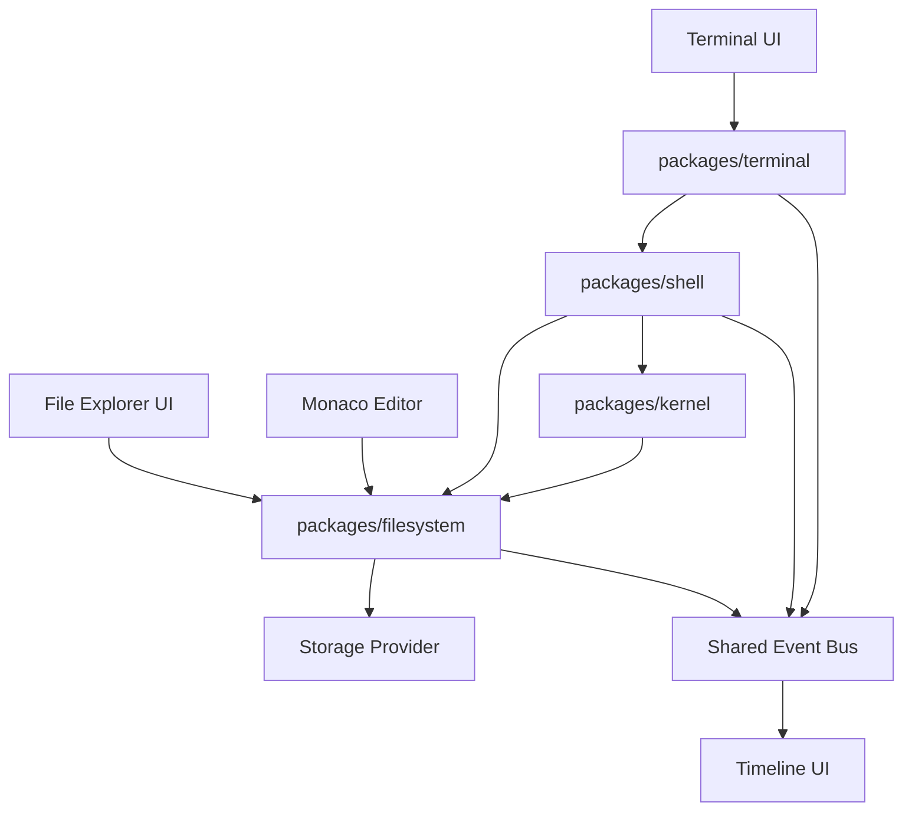
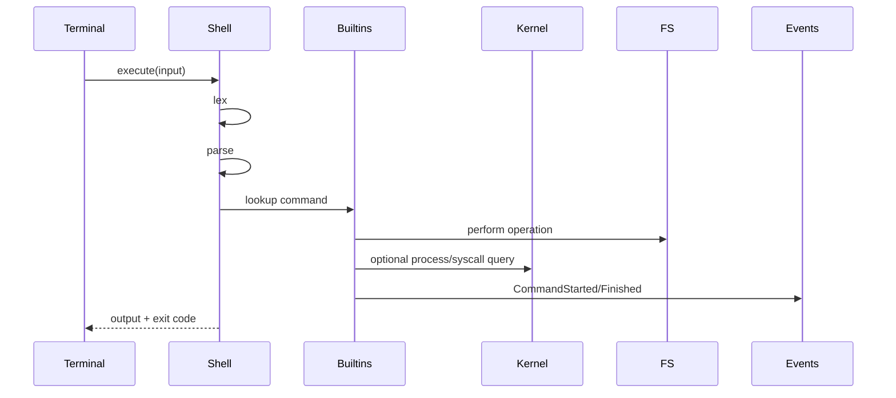

# NovaOS
# 05 - Filesystem, Shell & Terminal Specification

Version: 2.0

Status: Implementation Specification

Depends On:
- 01-product-requirements.md
- 02-system-architecture.md
- 04-kernel-memory-processes.md

Primary Packages:
- `packages/filesystem`
- `packages/shell`
- `packages/terminal`
- `packages/kernel`
- `apps/web`

---

# 1. Purpose

This document defines the NovaOS virtual filesystem, shell language, terminal runtime, file explorer synchronization model, command execution pipeline, persistence model, and educational visualization behavior.

NovaOS needs a filesystem and shell for three reasons.

First, they make the simulator feel like a real operating system.

Second, they provide a natural interface for writing, compiling, running, and debugging programs.

Third, they make operating system concepts visible: paths, files, permissions, descriptors, syscalls, process I/O, and persistent state.

The filesystem is Unix-inspired but not POSIX-complete.

The shell is Bash-inspired but intentionally smaller.

The terminal should feel modern and developer-friendly.

---

# 2. Design Goals

The filesystem and shell must be:

- deterministic
- beginner-friendly
- inspectable
- event-driven
- testable without UI
- synchronized with file explorer
- integrated with kernel syscalls
- safe for browser execution
- extensible for scripting, pipes, and plugins

The system should support two usage styles:

1. Visual users who use the file explorer and editor.
2. Terminal users who prefer shell commands.

Both must operate on the same underlying filesystem state.

---

# 3. Architectural Placement



The filesystem package owns filesystem truth.

The shell package parses and executes commands.

The terminal package owns interactive terminal behavior such as input buffer, history, autocomplete, and output rendering model.

UI components render state and send user intents.

---

# 4. Package Responsibilities

## `packages/filesystem`

Owns:

- inode tree
- file and directory metadata
- path resolution
- permissions
- file operations
- file descriptor model
- persistence adapters
- filesystem snapshots
- filesystem events

Does not own:

- React components
- terminal key handling
- command parsing
- kernel process scheduling

## `packages/shell`

Owns:

- shell lexer
- shell parser
- shell AST
- command execution
- built-in command registry
- command diagnostics
- shell environment model

Does not own:

- terminal rendering
- raw filesystem storage
- UI file explorer state

## `packages/terminal`

Owns:

- terminal sessions
- input buffer
- command history
- autocomplete coordination
- terminal output model
- keyboard behavior contracts
- terminal events

Does not own:

- shell grammar details
- filesystem implementation
- React rendering

---

# 5. Filesystem Conceptual Model

NovaOS uses a hierarchical virtual filesystem.

Initial tree:

```text
/
├── bin/
│   ├── cat
│   ├── clear
│   ├── compile
│   ├── debug
│   ├── echo
│   ├── help
│   ├── ls
│   ├── run
│   └── sysinfo
├── boot/
│   └── kernel.conf
├── dev/
│   ├── null
│   ├── random
│   └── terminal0
├── etc/
│   └── motd
├── home/
│   └── student/
│       ├── main.asm
│       ├── hello.c
│       └── README.txt
├── proc/
├── tmp/
└── usr/
    └── examples/
```

Directories and files are represented as inodes.

Special pseudo-files such as `/proc` may be generated dynamically in future versions.

Version 1 may treat `/proc` as read-only generated content.

---

# 6. Inode Model

```ts
export type InodeKind =
  | "file"
  | "directory"
  | "device"
  | "symlink";

export interface Inode {
  id: InodeId;
  kind: InodeKind;
  name: string;
  parentId: InodeId | null;
  owner: UserId;
  group: GroupId;
  permissions: FilePermissions;
  createdAtTick: number;
  modifiedAtTick: number;
  accessedAtTick: number;
  sizeBytes: number;
  metadata: InodeMetadata;
}
```

File inode:

```ts
export interface FileInode extends Inode {
  kind: "file";
  contentRef: ContentRef;
  mimeType: string;
  encoding: "utf-8" | "binary";
}
```

Directory inode:

```ts
export interface DirectoryInode extends Inode {
  kind: "directory";
  children: ReadonlyMap<string, InodeId>;
}
```

Device inode:

```ts
export interface DeviceInode extends Inode {
  kind: "device";
  deviceKind: "terminal" | "null" | "random";
}
```

Symlink support is optional for Version 1.

If not implemented, reserve the type but reject symlink creation with a clear diagnostic.

---

# 7. File Content Storage

Separate metadata from content.

```ts
export interface FileContentStore {
  read(ref: ContentRef): FsResult<Uint8Array>;
  write(ref: ContentRef, bytes: Uint8Array): FsResult<void>;
  delete(ref: ContentRef): FsResult<void>;
  snapshot(): ContentStoreSnapshot;
}
```

This separation makes future persistence, copy-on-write, deduplication, and cloud sync easier.

For Version 1, an in-memory content store plus browser persistence is sufficient.

Text helpers:

```ts
readText(path: Path): FsResult<string>;
writeText(path: Path, content: string): FsResult<void>;
```

Binary helpers:

```ts
readBytes(path: Path): FsResult<Uint8Array>;
writeBytes(path: Path, bytes: Uint8Array): FsResult<void>;
```

---

# 8. Path Model

Supported path forms:

- absolute: `/home/student/main.asm`
- relative: `main.asm`
- parent: `../examples`
- current directory: `.`
- home: `~/main.asm`

Canonical path rules:

- collapse repeated slashes
- resolve `.`
- resolve `..`
- reject traversal above root
- expand `~` to current user's home
- preserve case
- do not allow empty file names
- reject null bytes and invalid characters

Path type:

```ts
export type Path = Brand<string, "Path">;
export type AbsolutePath = Brand<string, "AbsolutePath">;
```

Path resolver:

```ts
export interface PathResolver {
  resolve(input: string, context: PathResolutionContext): FsResult<ResolvedPath>;
}
```

Context:

```ts
export interface PathResolutionContext {
  cwd: AbsolutePath;
  home: AbsolutePath;
  user: UserId;
  followSymlinks: boolean;
}
```

Resolved path:

```ts
export interface ResolvedPath {
  absolutePath: AbsolutePath;
  inodeId: InodeId | null;
  parentId: InodeId | null;
  basename: string;
}
```

---

# 9. Permissions Model

NovaOS uses educational Unix-style permissions.

```text
rwxr-xr-x
```

Type:

```ts
export interface FilePermissions {
  owner: PermissionBits;
  group: PermissionBits;
  other: PermissionBits;
}

export interface PermissionBits {
  read: boolean;
  write: boolean;
  execute: boolean;
}
```

Version 1:

- enforce owner permissions
- represent group/other for educational display
- default user: `student`
- kernel bypasses permissions in kernel mode
- `/bin` executable files are executable
- `/home/student` is writable
- `/boot`, `/etc`, and `/usr/examples` may be read-only by default

Permission errors must be educational.

Example:

```text
Permission denied: /boot/kernel.conf is read-only for user student.
```

---

# 10. File Descriptor Model

Processes interact with files through descriptors.

Descriptor table is part of PCB or kernel process resource state.

Standard descriptors:

| FD | Name | Description |
|---:|---|---|
| 0 | stdin | terminal input |
| 1 | stdout | terminal output |
| 2 | stderr | terminal error output |

Open file description:

```ts
export interface OpenFileDescription {
  fd: FileDescriptor;
  inodeId: InodeId;
  path: AbsolutePath;
  mode: FileOpenMode;
  offset: number;
  readable: boolean;
  writable: boolean;
  append: boolean;
}
```

File open modes:

```ts
export type FileOpenMode =
  | "read"
  | "write"
  | "append"
  | "read-write";
```

Syscalls:

- `open`
- `read`
- `write`
- `close`

Shell built-ins may use filesystem APIs directly when running as shell internals, but compiled user programs should go through syscalls.

---

# 11. Filesystem API

```ts
export interface FileSystem {
  stat(path: string, context: FsContext): FsResult<InodeStat>;
  list(path: string, context: FsContext): FsResult<DirectoryEntry[]>;
  readFile(path: string, context: FsContext): FsResult<Uint8Array>;
  writeFile(path: string, bytes: Uint8Array, context: FsContext): FsResult<void>;
  appendFile(path: string, bytes: Uint8Array, context: FsContext): FsResult<void>;
  createFile(path: string, options: CreateFileOptions, context: FsContext): FsResult<InodeId>;
  createDirectory(path: string, options: CreateDirectoryOptions, context: FsContext): FsResult<InodeId>;
  remove(path: string, options: RemoveOptions, context: FsContext): FsResult<void>;
  move(from: string, to: string, context: FsContext): FsResult<void>;
  copy(from: string, to: string, context: FsContext): FsResult<InodeId>;
  snapshot(): FileSystemSnapshot;
  restore(snapshot: FileSystemSnapshot): FsResult<void>;
}
```

Filesystem context:

```ts
export interface FsContext {
  user: UserId;
  cwd: AbsolutePath;
  mode: "kernel" | "user";
  pid: ProcessId | null;
  tick: number;
}
```

---

# 12. Required File Operations

## `stat`

Returns metadata for a path.

Must fail if path does not exist.

## `list`

Lists directory entries.

Must fail if target is not a directory.

Entries should be sorted deterministically:

1. directories before files
2. alphabetical by name

## `readFile`

Reads file content.

Must fail for directories.

Must check read permission.

## `writeFile`

Creates or replaces file content depending on options.

Must check write permission on file or parent directory.

## `appendFile`

Adds bytes to end.

Must check write permission.

## `createFile`

Creates a file.

Must fail if path already exists unless overwrite option is explicit.

## `createDirectory`

Creates a directory.

Supports optional recursive mode.

## `remove`

Deletes file or directory.

Non-empty directory requires recursive option.

## `move`

Renames or moves inode.

Must prevent moving directory into its own descendant.

## `copy`

Copies file or directory.

Recursive copy required for directories if enabled.

---

# 13. Filesystem Events

Filesystem operations emit events.

```ts
export type FileSystemEvent =
  | FileCreatedEvent
  | FileReadEvent
  | FileWrittenEvent
  | FileDeletedEvent
  | FileMovedEvent
  | FileCopiedEvent
  | DirectoryCreatedEvent
  | DirectoryDeletedEvent
  | PermissionsChangedEvent
  | FileOpenedEvent
  | FileClosedEvent;
```

Every event includes:

- event ID
- sequence number
- tick
- operation
- path
- inode ID
- process ID if applicable
- user ID
- result status

Events power:

- timeline
- file explorer updates
- educational explanations
- deterministic replay

---

# 14. Persistence Model

Version 1 persists filesystem state in browser storage.

Recommended default:

- IndexedDB for larger content
- localStorage only for lightweight preferences

Storage provider interface:

```ts
export interface FileSystemStorageProvider {
  load(): Promise<FsResult<FileSystemSnapshot>>;
  save(snapshot: FileSystemSnapshot): Promise<FsResult<void>>;
  clear(): Promise<FsResult<void>>;
}
```

Snapshot format:

```ts
export interface FileSystemSnapshot {
  version: number;
  rootInodeId: InodeId;
  inodes: Record<string, SerializedInode>;
  contentStore: ContentStoreSnapshot;
  nextInodeId: number;
}
```

Snapshots must be versioned.

Migrations:

```ts
export interface FileSystemMigration {
  fromVersion: number;
  toVersion: number;
  migrate(snapshot: unknown): FsResult<FileSystemSnapshot>;
}
```

Import/export should use JSON for educational readability, with binary file content encoded safely.

---

# 15. Shell Overview

NovaShell is the command language for NovaOS.

It should support familiar commands while remaining simple enough to teach.

Version 1 supports:

- command name
- positional arguments
- quoted strings
- basic flags
- current directory
- command history
- autocomplete
- stdout/stderr output
- exit status
- built-in commands

Future versions support:

- pipes
- redirects
- variables
- aliases
- scripts
- command substitution
- job control

---

# 16. Shell Lexing

The lexer converts terminal input into tokens.

Token types:

```ts
export type ShellTokenKind =
  | "word"
  | "string"
  | "flag"
  | "pipe"
  | "redirect-output"
  | "redirect-append"
  | "redirect-input"
  | "semicolon"
  | "whitespace"
  | "eof";
```

Version 1 may lex pipe and redirects as reserved tokens even if execution is not implemented.

Quoted strings:

```bash
echo "hello world"
```

Escapes:

- `\"`
- `\\`
- `\n`
- `\t`

Lexer must preserve source spans for diagnostics and autocomplete.

---

# 17. Shell Parsing

AST:

```ts
export interface CommandLineNode {
  kind: "command-line";
  commands: CommandNode[];
}

export interface CommandNode {
  kind: "command";
  name: string;
  args: ShellArgument[];
  redirects: RedirectNode[];
  span: SourceSpan;
}

export interface ShellArgument {
  raw: string;
  value: string;
  quoted: boolean;
  span: SourceSpan;
}
```

Version 1 execution supports one command at a time.

The parser should still produce AST forms that allow future pipelines.

Parsing errors should be recoverable where possible.

Example diagnostic:

```text
Unclosed quote starting at column 6.
```

---

# 18. Shell Execution Model

Command execution flow:



Result:

```ts
export interface ShellExecutionResult {
  exitCode: number;
  stdout: TerminalOutputChunk[];
  stderr: TerminalOutputChunk[];
  cwd: AbsolutePath;
  events: ShellEvent[];
}
```

Shell context:

```ts
export interface ShellContext {
  user: UserId;
  cwd: AbsolutePath;
  home: AbsolutePath;
  env: ShellEnvironment;
  pid: ProcessId;
  terminalId: TerminalId;
}
```

---

# 19. Shell Built-in Commands

## Navigation

### `pwd`

Print current directory.

### `cd <path>`

Change current directory.

Rules:

- no args -> home directory
- `cd -` future support
- fail if target is not directory
- fail if no execute permission

### `ls [path]`

List directory.

Options:

- `-l` long format
- `-a` show hidden files

### `tree [path]`

Display recursive tree.

Limit recursion depth to prevent huge output.

---

## Filesystem

### `mkdir <path>`

Options:

- `-p` create parents

### `touch <path>`

Create file or update modified tick.

### `cat <path>`

Print file content.

Must reject binary files with helpful message.

### `rm <path>`

Options:

- `-r` recursive
- `-f` force

### `cp <from> <to>`

Copy file or directory.

### `mv <from> <to>`

Move or rename.

### `edit <path>`

Open file in editor.

This command emits an app intent event rather than modifying the filesystem directly.

---

## System

### `ps`

Print process table.

### `kill <pid>`

Request kernel to terminate process.

### `top`

Show process summary.

Version 1 may print static snapshot rather than live full-screen top.

### `mem`

Print memory summary.

### `cpu`

Print CPU/register summary.

### `sysinfo`

Print NovaOS version, uptime, memory, scheduler, and process count.

---

## Development

### `compile <file>`

Compile Toy C or assembly depending on extension.

### `run <file>`

Run assembly, bytecode, or compiled executable.

### `debug <file>`

Open debug workflow.

### `trace [pid]`

Show timeline events for process.

---

## Utility

### `clear`

Clear terminal buffer.

### `help [command]`

Print command list or command-specific help.

### `history`

Print command history.

### `echo <text>`

Print text.

---

# 20. Command Registry

Commands should be registered through a typed registry.

```ts
export interface ShellCommand {
  readonly name: string;
  readonly summary: string;
  readonly usage: string;
  readonly aliases: string[];
  readonly options: CommandOptionSpec[];
  execute(args: ParsedArgs, context: ShellCommandContext): Promise<ShellExecutionResult>;
}

export interface CommandRegistry {
  register(command: ShellCommand): void;
  get(name: string): ShellCommand | null;
  list(): ShellCommand[];
}
```

Benefits:

- autocomplete can read command specs
- help can be generated
- plugins can add commands later
- tests can execute commands uniformly

---

# 21. Terminal Runtime

Terminal runtime is independent from React rendering.

State:

```ts
export interface TerminalSession {
  id: TerminalId;
  title: string;
  cwd: AbsolutePath;
  inputBuffer: string;
  cursorPosition: number;
  history: string[];
  historyIndex: number | null;
  output: TerminalOutputChunk[];
  runningCommand: RunningCommand | null;
}
```

Output chunk:

```ts
export type TerminalOutputKind =
  | "stdout"
  | "stderr"
  | "system"
  | "prompt"
  | "diagnostic";

export interface TerminalOutputChunk {
  id: OutputChunkId;
  kind: TerminalOutputKind;
  text: string;
  timestampTick: number;
  links?: TerminalLink[];
}
```

Clickable links:

- file paths
- process IDs
- memory addresses
- event IDs

---

# 22. Terminal Keyboard Behavior

Required shortcuts:

| Shortcut | Behavior |
|---|---|
| `Enter` | Execute command |
| `Tab` | Autocomplete |
| `ArrowUp` | Previous history |
| `ArrowDown` | Next history |
| `Ctrl+C` | Interrupt command/process |
| `Ctrl+L` | Clear terminal |
| `Ctrl+R` | Search history |
| `Home` | Start of line |
| `End` | End of line |

Mac equivalents should also work where appropriate.

Terminal input should preserve cursor position, not just append text.

---

# 23. Autocomplete

Autocomplete sources:

- command names
- file paths
- flags/options
- process IDs for process commands
- memory addresses for memory commands
- tutorial names for tutorial commands

Autocomplete API:

```ts
export interface CompletionProvider {
  getCompletions(context: CompletionContext): Promise<CompletionResult>;
}
```

Completion context:

```ts
export interface CompletionContext {
  input: string;
  cursorPosition: number;
  cwd: AbsolutePath;
  user: UserId;
}
```

Completion result:

```ts
export interface CompletionResult {
  replacementRange: SourceSpan;
  items: CompletionItem[];
}
```

---

# 24. File Explorer Synchronization

The file explorer and terminal must remain consistent.

If terminal runs:

```bash
mkdir demos
touch demos/hello.asm
```

File explorer must update immediately.

If file explorer renames a file, shell `ls` must reflect it immediately.

Synchronization source:

- filesystem events
- filesystem snapshot queries

The UI should not maintain an independent fake file tree.

File explorer actions should call filesystem APIs.

---

# 25. Editor Integration

Editor actions:

- open file
- save file
- rename file
- create file
- delete file
- mark unsaved
- show diagnostics

Rules:

- editor reads/writes via filesystem package
- editor must handle external modifications
- unsaved changes need conflict detection
- saving emits filesystem events
- compile command should use saved content unless unsaved-content compilation is explicitly implemented

Conflict example:

```text
This file changed on disk while you were editing it. Choose which version to keep.
```

---

# 26. Shell and Kernel Integration

Shell commands that inspect OS state should call kernel APIs or read kernel snapshots.

Examples:

- `ps` uses process table snapshot
- `kill` requests process termination
- `mem` uses memory snapshot
- `cpu` uses CPU/register snapshot
- `run` creates a process
- `debug` creates process in paused/debug mode

Compiled programs do not directly invoke shell commands.

Compiled programs use syscalls.

Shell is a user interface; kernel is system authority.

---

# 27. I/O Model

Version 1 terminal I/O:

- stdout and stderr go to terminal output chunks
- stdin may be simulated for simple read operations
- interactive stdin can be future work

Process output flow:

```text
Program SYSCALL print
  ↓
Kernel syscall handler
  ↓
Terminal device write
  ↓
Terminal output chunk
  ↓
Terminal UI render
```

This makes output realistic and inspectable.

---

# 28. Diagnostics and Errors

All filesystem and shell errors must be structured.

```ts
export interface FsDiagnostic {
  code: string;
  severity: "info" | "warning" | "error";
  message: string;
  path?: AbsolutePath;
  hint?: string;
}
```

Example errors:

```text
File not found: /home/student/missing.asm
Hint: Run `ls /home/student` to see available files.
```

```text
Cannot remove /home/student/projects because it is a non-empty directory.
Hint: Use `rm -r /home/student/projects` to remove recursively.
```

```text
Command not found: rn
Hint: Did you mean `run`?
```

Command suggestions should use simple edit distance.

---

# 29. Event Contracts

Shell events:

```ts
export type ShellEvent =
  | CommandStartedEvent
  | CommandFinishedEvent
  | CommandFailedEvent
  | CurrentDirectoryChangedEvent
  | CommandHistoryUpdatedEvent;
```

Terminal events:

```ts
export type TerminalEvent =
  | TerminalInputChangedEvent
  | TerminalCommandSubmittedEvent
  | TerminalOutputAppendedEvent
  | TerminalClearedEvent
  | TerminalInterruptedEvent
  | TerminalAutocompleteRequestedEvent;
```

App intent events:

```ts
export type AppIntentEvent =
  | OpenFileIntent
  | OpenDebuggerIntent
  | FocusPanelIntent
  | RevealInFileExplorerIntent
  | GoToMemoryAddressIntent
  | GoToProcessIntent;
```

Command events should include correlation IDs so the timeline can group shell input, filesystem changes, kernel changes, and output.

---

# 30. Determinism Requirements

Filesystem operations must be deterministic.

Rules:

- directory listing order is explicit
- timestamps use simulated tick, not wall-clock time
- inode IDs allocate deterministically
- command output ordering is stable
- persistence serialization sorts keys
- random device uses deterministic PRNG when in replay mode

Forbidden in core packages:

- `Date.now()`
- `Math.random()`
- locale-dependent sorting unless explicitly fixed
- async race ordering that changes command results

---

# 31. Persistence and Reset UX

Users need control over virtual disk state.

Required actions:

- save automatically
- export filesystem
- import filesystem
- reset to default
- reset examples only
- clear `/tmp`
- duplicate project workspace

Before destructive reset, show confirmation.

In Claude Code implementation, avoid destructive browser storage operations without explicit user action.

---

# 32. Tutorial Hooks

Filesystem and shell should support tutorials.

Tutorial system needs hooks:

- command executed
- file created
- file opened
- compile run
- process started
- output observed
- error occurred

Example tutorial:

1. User runs `pwd`.
2. Tutorial explains current directory.
3. User runs `ls`.
4. Tutorial highlights file explorer.
5. User opens `hello.asm`.
6. Tutorial highlights editor.
7. User runs `compile hello.asm`.
8. Tutorial highlights compiler output.
9. User runs `run hello`.
10. Tutorial highlights process and terminal output.

---

# 33. Testing Strategy

## Filesystem unit tests

Required:

- path normalization
- absolute/relative resolution
- create file
- create directory
- recursive directory creation
- read/write/append
- delete file
- delete non-empty directory failure
- recursive delete
- move file
- move directory
- prevent moving directory into itself
- copy file
- copy directory
- permission denied
- stat
- deterministic listing
- snapshot/restore

## Shell unit tests

Required:

- lex simple command
- lex quoted string
- reject unclosed quote
- parse command args
- parse flags
- command not found
- help output
- cd updates cwd
- ls output deterministic
- rm requires `-r` for directories
- command suggestions

## Terminal tests

Required:

- input buffer editing
- history navigation
- Ctrl+C interrupt
- Ctrl+L clear
- autocomplete trigger
- output chunk append
- clickable links metadata

## Integration tests

Required flows:

- create file in terminal and see file explorer update
- create file in explorer and read through shell
- edit file and compile it
- run program and print output
- reset filesystem
- snapshot/restore filesystem

---

# 34. Performance Requirements

Targets:

```text
Path resolution: O(depth)
Directory list under 1,000 entries: < 16 ms
Read small text file: < 5 ms
Write small text file: < 5 ms
Terminal command execution: < 50 ms for simple commands
Autocomplete response: < 100 ms
Filesystem snapshot: < 50 ms for normal demo projects
```

Large outputs must be virtualized or chunked.

Terminal should cap retained output or support scrollback limits.

Default scrollback limit:

```text
10,000 output chunks
```

---

# 35. Security and Safety

Even though NovaOS is simulated, user content may be pasted or imported.

Rules:

- never execute shell input as JavaScript
- never use host `eval`
- sanitize imported filesystem JSON
- validate snapshot schema
- prevent path traversal outside virtual root
- cap file sizes
- cap recursive operations
- protect against huge terminal output
- prevent infinite shell command loops when scripts are added

Resource limits:

```ts
export interface FileSystemLimits {
  maxFileSizeBytes: number;
  maxFiles: number;
  maxDirectoryDepth: number;
  maxPathLength: number;
  maxCommandLength: number;
  maxTerminalOutputChunks: number;
}
```

---

# 36. Implementation Order

Recommended order:

1. Shared filesystem types.
2. Inode model.
3. Content store.
4. Path resolver.
5. File operations.
6. Permission checks.
7. Filesystem events.
8. Snapshot/restore.
9. Browser persistence adapter.
10. Shell lexer.
11. Shell parser.
12. Command registry.
13. Core built-ins: `pwd`, `cd`, `ls`, `cat`, `mkdir`, `touch`.
14. More built-ins: `rm`, `cp`, `mv`, `tree`, `help`, `history`, `echo`.
15. Kernel commands: `ps`, `kill`, `mem`, `cpu`, `sysinfo`.
16. Development commands: `compile`, `run`, `debug`, `trace`.
17. Terminal runtime.
18. Autocomplete.
19. File explorer integration.
20. Editor integration.
21. E2E tests.

Do not implement pipes or scripting before the core command execution model is stable.

---

# 37. Agent Ownership Recommendations

Relevant agents:

- Agent 24: Filesystem Core
- Agent 25: File Operations
- Agent 26: Filesystem Persistence
- Agent 27: Shell Parser
- Agent 28: Shell Builtins
- Agent 29: Terminal Runtime
- Agent 42: Editor
- Agent 43: Terminal UI
- Agent 47: Tutorials and Examples
- Agent 48: Testing and QA

Suggested parallelization:

- Filesystem core and shell lexer can begin after shared types.
- Shell built-ins should wait for filesystem API.
- Terminal UI should wait for terminal runtime contract.
- File explorer should wait for filesystem events and snapshot contract.
- Development commands should wait for compiler/assembler interfaces.

---

# 38. Minimum Viable Filesystem and Shell Demo

Demo script:

```bash
pwd
ls
mkdir demos
cd demos
touch hello.asm
echo "MOV R0, 5" > hello.asm
cat hello.asm
cd ..
tree
sysinfo
```

Expected:

- terminal displays commands and output
- file explorer updates live
- timeline records file operations
- current directory changes
- filesystem survives refresh
- errors are helpful

If redirects are not implemented in Version 1, replace `echo ... > file` with editor save or `writefile` dev command. However, the architecture should reserve redirect parsing.

---

# 39. Future Extensions

Planned:

- pipes
- redirects
- shell variables
- aliases
- shell scripts
- job control
- background processes
- package manager
- Git-like versioning
- symbolic links
- multi-user permissions
- `/proc` dynamic process files
- `/dev` device abstractions
- cloud sync
- collaborative file editing
- shell plugins
- filesystem drivers

Architecture must not block these.

---

# 40. Definition of Done

The filesystem, shell, and terminal subsystem is complete when:

- filesystem supports deterministic inode tree
- path resolution handles absolute, relative, `.`, `..`, and `~`
- file operations are implemented and tested
- permissions are represented and owner permissions enforced
- file descriptors exist for process I/O
- filesystem events are emitted for all mutations
- filesystem snapshot/restore works
- browser persistence survives refresh
- shell lexer and parser produce structured ASTs
- built-in commands work with helpful diagnostics
- terminal runtime supports history, autocomplete, clear, interrupt, and output chunks
- shell and file explorer remain synchronized
- editor reads and writes through filesystem APIs
- kernel commands integrate with kernel snapshots
- development commands integrate with compiler/debugger contracts
- command output is deterministic
- all public APIs are documented
- tests cover filesystem, shell, terminal, and integration flows
- no UI package is imported into filesystem or shell core packages

---

# 41. Final Principle

The filesystem and shell are the user's front door into NovaOS.

They should feel familiar enough that a student can start immediately, but transparent enough that every command becomes a lesson in operating systems.

When a user runs `ls`, they should not only see files.

They should be able to inspect path resolution, permissions, inode metadata, events, syscalls, and terminal output.

That is what makes NovaOS more than a terminal clone.

It is an operating systems laboratory.
