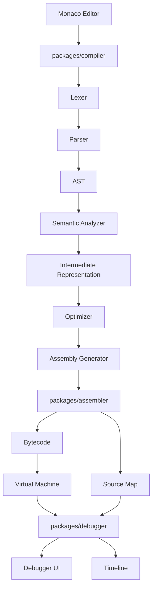
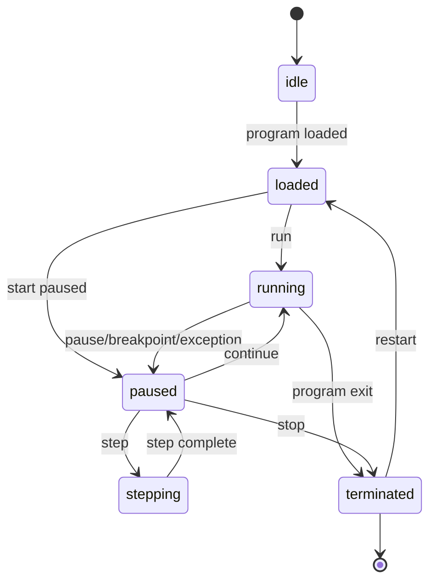

# NovaOS
# 06 - Compiler, Assembler & Debugger Specification

Version: 2.0

Status: Implementation Specification

Depends On:
- 01-product-requirements.md
- 02-system-architecture.md
- 03-virtual-machine.md
- 04-kernel-memory-processes.md
- 05-filesystem-shell.md

Primary Packages:
- `packages/compiler`
- `packages/assembler`
- `packages/debugger`
- `packages/cpu`
- `packages/simulator`
- `apps/web`

---

# 1. Purpose

This document defines the NovaOS language toolchain and debugger.

The toolchain includes:

- Toy C language
- lexer
- parser
- AST
- semantic analyzer
- intermediate representation
- optimization passes
- assembly generation
- assembler
- bytecode encoder
- source maps
- diagnostics

The debugger includes:

- run control
- stepping
- breakpoints
- watch expressions
- call stack
- source-level mapping
- instruction-level mapping
- timeline
- snapshots
- deterministic replay
- time-travel debugging

The goal is not to build a production C compiler.

The goal is to build a transparent educational compiler and debugger that lets users see every stage between source code and machine execution.

---

# 2. Design Goals

The compiler, assembler, and debugger must be:

- deterministic
- inspectable at every stage
- strongly typed
- beginner-friendly
- connected to VM execution
- source-map aware
- testable without UI
- capable of rich diagnostics
- extensible for future language features

Most importantly:

> Every emitted bytecode instruction should be explainable in terms of source code, assembly, and VM behavior.

---

# 3. Architectural Placement



Compiler and assembler packages must not import UI code.

Debugger core must not import React.

UI consumes debugger state and events through stable contracts.

---

# 4. Package Responsibilities

## `packages/compiler`

Owns:

- Toy C lexer
- Toy C parser
- AST
- semantic analysis
- IR
- optimization passes
- assembly generation
- compiler diagnostics

Does not own:

- bytecode encoding details if delegated to assembler
- UI panels
- VM execution loop
- terminal rendering

## `packages/assembler`

Owns:

- NovaASM parser
- label resolution
- operand validation
- instruction encoding
- bytecode object format
- symbol table
- assembler diagnostics
- assembly-level source maps

Does not own:

- high-level Toy C semantics
- VM runtime execution
- debugger UI

## `packages/debugger`

Owns:

- debugger state machine
- breakpoints
- stepping semantics
- watch expressions
- call stack model
- timeline integration
- snapshots
- replay coordination

Does not own:

- visual components
- code editor implementation
- compiler parsing internals

---

# 5. End-to-End Pipeline

```text
Toy C Source
    ↓
Lexer
    ↓
Tokens
    ↓
Parser
    ↓
AST
    ↓
Semantic Analysis
    ↓
Typed AST + Symbol Table
    ↓
IR Generation
    ↓
IR
    ↓
Optimization Passes
    ↓
Optimized IR
    ↓
Assembly Generation
    ↓
NovaASM
    ↓
Assembler
    ↓
Bytecode Object
    ↓
Kernel Program Loader
    ↓
Virtual Machine
    ↓
Debugger + Timeline
```

Every arrow represents an inspectable artifact.

The UI should allow users to view:

- tokens
- AST
- diagnostics
- symbol table
- IR
- optimized IR
- assembly
- bytecode
- source maps
- runtime execution trace

---

# 6. Compilation Artifact Model

```ts
export interface CompilationResult {
  success: boolean;
  sourceFile: AbsolutePath;
  tokens?: Token[];
  ast?: ProgramNode;
  symbolTable?: SymbolTableSnapshot;
  ir?: IRModule;
  optimizedIr?: IRModule;
  assembly?: AssemblyModule;
  bytecode?: BytecodeObject;
  sourceMap?: SourceMap;
  diagnostics: Diagnostic[];
  timings: CompilationTimings;
}
```

Timings use simulated or measured host time for UI reporting only.

Timings must not affect deterministic runtime behavior.

---

# 7. Toy C Scope

Version 1 Toy C supports:

- integer type
- boolean type
- void return type
- variables
- assignment
- arithmetic
- comparison
- if / else
- while loops
- functions
- return statements
- function calls
- line comments
- block comments

Version 1 may omit:

- structs
- pointers
- arrays
- floats
- strings as first-class values
- preprocessor
- include files
- recursion if stack frame support is not ready

However, the architecture should not prevent these future features.

---

# 8. Toy C Example

```c
int add(int a, int b) {
  return a + b;
}

int main() {
  int x = 5;
  int y = 10;
  int z = add(x, y);
  print(z);
  return 0;
}
```

Expected conceptual lowering:

```asm
.global main

add:
  PUSH BP
  MOV BP, SP
  LOAD R0, [BP + 2]
  LOAD R1, [BP + 3]
  ADD R2, R0, R1
  MOV R0, R2
  POP BP
  RET

main:
  MOV R0, 5
  MOV R1, 10
  CALL add
  SYSCALL print
  MOV R0, 0
  RET
```

Exact calling convention is defined later in this document.

---

# 9. Lexer Specification

The lexer converts source text to tokens while preserving source locations.

Token type:

```ts
export interface Token {
  kind: TokenKind;
  lexeme: string;
  literal?: number | string | boolean;
  span: SourceSpan;
}
```

Token kinds:

```ts
export type TokenKind =
  | "identifier"
  | "integer"
  | "keyword"
  | "operator"
  | "punctuation"
  | "string"
  | "comment"
  | "eof";
```

Keywords:

```text
int
bool
void
if
else
while
return
true
false
print
```

Operators:

```text
+
-
*
/
%
=
==
!=
<
<=
>
>=
&&
||
!
```

Punctuation:

```text
(
)
{
}
,
;
```

Comments:

```c
// line comment

/* block comment */
```

Comments may be emitted for educational display but ignored by parser.

Lexer diagnostics:

- unknown character
- unterminated string
- unterminated block comment
- integer literal out of range

---

# 10. Parser Specification

The parser produces an immutable AST.

Parsing strategy:

- recursive descent or Pratt parser is acceptable
- expression precedence must be explicit
- parser should recover from errors where practical
- diagnostics must include source spans

Top-level grammar sketch:

```text
program         -> declaration* EOF
declaration     -> functionDecl | varDecl
functionDecl    -> type IDENT "(" params? ")" block
params          -> param ("," param)*
param           -> type IDENT
varDecl         -> type IDENT ("=" expression)? ";"
statement       -> block | ifStmt | whileStmt | returnStmt | exprStmt | varDecl
block           -> "{" statement* "}"
ifStmt          -> "if" "(" expression ")" statement ("else" statement)?
whileStmt       -> "while" "(" expression ")" statement
returnStmt      -> "return" expression? ";"
exprStmt        -> expression ";"
expression      -> assignment
assignment      -> IDENT "=" assignment | logicOr
logicOr         -> logicAnd ("||" logicAnd)*
logicAnd        -> equality ("&&" equality)*
equality        -> comparison (("==" | "!=") comparison)*
comparison      -> term ((">" | ">=" | "<" | "<=") term)*
term            -> factor (("+" | "-") factor)*
factor          -> unary (("*" | "/" | "%") unary)*
unary           -> ("!" | "-") unary | call
call            -> primary ("(" arguments? ")")*
primary         -> INTEGER | "true" | "false" | IDENT | "(" expression ")"
```

---

# 11. AST Model

Representative AST types:

```ts
export interface ProgramNode {
  kind: "Program";
  declarations: DeclarationNode[];
  span: SourceSpan;
}

export type DeclarationNode =
  | FunctionDeclarationNode
  | VariableDeclarationNode;

export interface FunctionDeclarationNode {
  kind: "FunctionDeclaration";
  name: IdentifierNode;
  parameters: ParameterNode[];
  returnType: TypeNode;
  body: BlockStatementNode;
  span: SourceSpan;
}

export type StatementNode =
  | BlockStatementNode
  | VariableDeclarationNode
  | IfStatementNode
  | WhileStatementNode
  | ReturnStatementNode
  | ExpressionStatementNode;

export type ExpressionNode =
  | BinaryExpressionNode
  | UnaryExpressionNode
  | AssignmentExpressionNode
  | CallExpressionNode
  | IdentifierNode
  | IntegerLiteralNode
  | BooleanLiteralNode;
```

AST nodes must be immutable after creation.

AST should preserve spans for source maps and diagnostics.

---

# 12. Semantic Analysis

Semantic analysis validates program meaning.

Responsibilities:

- build symbol table
- validate declarations
- resolve identifiers
- check types
- check function calls
- check return statements
- reject duplicate names in same scope
- reject undefined variables
- reject invalid assignments
- mark unreachable code where possible

Symbol table:

```ts
export interface SymbolTable {
  globals: Scope;
  functions: ReadonlyMap<string, FunctionSymbol>;
  scopes: Scope[];
}
```

Type system:

```ts
export type ToyType =
  | { kind: "int" }
  | { kind: "bool" }
  | { kind: "void" }
  | { kind: "error" };
```

Diagnostics examples:

```text
Undefined variable `count`.
Type mismatch: expected int but found bool.
Function `add` expects 2 arguments but received 1.
Cannot return a value from void function `main`.
Missing return statement in function returning int.
```

Semantic analyzer should continue after errors to report multiple diagnostics.

---

# 13. Intermediate Representation

NovaIR is simple and educational.

Goals:

- easy to visualize
- easy to lower to assembly
- stable for optimization passes
- source-location aware

IR module:

```ts
export interface IRModule {
  functions: IRFunction[];
  globals: IRGlobal[];
  diagnostics: Diagnostic[];
}
```

IR function:

```ts
export interface IRFunction {
  name: string;
  parameters: IRParameter[];
  blocks: IRBasicBlock[];
  returnType: ToyType;
  sourceSpan: SourceSpan;
}
```

Basic block:

```ts
export interface IRBasicBlock {
  id: BasicBlockId;
  label: string;
  instructions: IRInstruction[];
  terminator: IRTerminator;
}
```

Instruction examples:

```ts
export type IRInstruction =
  | { kind: "const"; target: IRValueId; value: number; span: SourceSpan }
  | { kind: "load"; target: IRValueId; name: string; span: SourceSpan }
  | { kind: "store"; name: string; value: IRValueId; span: SourceSpan }
  | { kind: "binary"; op: BinaryOp; target: IRValueId; left: IRValueId; right: IRValueId; span: SourceSpan }
  | { kind: "call"; target?: IRValueId; callee: string; args: IRValueId[]; span: SourceSpan };
```

Terminators:

```ts
export type IRTerminator =
  | { kind: "return"; value?: IRValueId; span: SourceSpan }
  | { kind: "jump"; target: BasicBlockId; span: SourceSpan }
  | { kind: "branch"; condition: IRValueId; thenBlock: BasicBlockId; elseBlock: BasicBlockId; span: SourceSpan };
```

SSA is optional in Version 1.

A simplified temporary-based IR is acceptable if it is deterministic and easy to lower.

---

# 14. Optimization Passes

Version 1 required passes:

## Constant Folding

Example:

```c
int x = 2 + 3;
```

becomes:

```c
int x = 5;
```

or equivalent IR.

## Dead Code Elimination

Remove instructions that cannot affect output.

Do not remove:

- syscalls
- function calls with side effects
- memory writes
- volatile future operations

## Copy Propagation

Replace trivial temporaries where safe.

Optimization interface:

```ts
export interface OptimizationPass {
  readonly id: string;
  readonly name: string;
  run(module: IRModule, context: OptimizationContext): OptimizationResult;
}
```

Optimization results should include explanation metadata for UI.

Users should be able to toggle passes.

---

# 15. Calling Convention

Version 1 calling convention should be simple.

Recommended:

- `R0` stores return value
- first arguments use `R0`, `R1`, `R2`, `R3` where possible
- additional arguments are pushed on stack
- `SP` is stack pointer
- `BP` is base pointer
- caller saves volatile registers
- callee saves `BP`

Function prologue:

```asm
PUSH BP
MOV BP, SP
```

Function epilogue:

```asm
MOV SP, BP
POP BP
RET
```

This convention must match debugger call stack reconstruction.

If implementation chooses a different convention, document it in an ADR and update tests.

---

# 16. Assembly Language: NovaASM

NovaASM is the human-readable assembly language for the NovaOS VM.

Example:

```asm
.global main

main:
  MOV R0, 5
  MOV R1, 10
  ADD R2, R0, R1
  SYSCALL 0
  HALT
```

Line structure:

```text
[label:] [instruction operands...] [; comment]
```

Comments:

```asm
; this is a comment
```

Labels:

```asm
loop:
  DEC R0
  JNE loop
```

Directives:

```asm
.text
.data
.global main
.byte 0x01
.word 42
.string "hello"
```

Version 1 may implement only `.text` and `.global`, but parser should reserve directive support.

---

# 17. Assembly Parser

Assembler pipeline:

```text
Source
  ↓
Lex lines
  ↓
Parse labels/directives/instructions
  ↓
Build symbol table
  ↓
Resolve labels
  ↓
Validate operands
  ↓
Encode bytecode
  ↓
Emit bytecode object + source map
```

Assembly AST:

```ts
export type AssemblyStatement =
  | LabelStatement
  | InstructionStatement
  | DirectiveStatement
  | CommentStatement;
```

Instruction statement:

```ts
export interface InstructionStatement {
  kind: "instruction";
  mnemonic: string;
  operands: AssemblyOperand[];
  span: SourceSpan;
}
```

Operand types:

```ts
export type AssemblyOperand =
  | { kind: "register"; name: RegisterName; span: SourceSpan }
  | { kind: "immediate"; value: number; span: SourceSpan }
  | { kind: "label-ref"; name: string; span: SourceSpan }
  | { kind: "memory"; base?: RegisterName; address?: number; offset?: number; span: SourceSpan };
```

---

# 18. Bytecode Object Format

Assembler output:

```ts
export interface BytecodeObject {
  version: number;
  entryPoint: Address;
  instructions: EncodedInstruction[];
  data: Uint8Array;
  symbols: SymbolTableSnapshot;
  sourceMap: SourceMap;
  diagnostics: Diagnostic[];
}
```

Encoded instruction:

```ts
export interface EncodedInstruction {
  address: Address;
  opcode: number;
  operandA: number;
  operandB: number;
  operandC: number;
  sourceSpan: SourceSpan | null;
}
```

Bytecode must be deterministic.

Given same assembly, assembler emits byte-for-byte identical bytecode.

---

# 19. Source Maps

Source maps connect:

- Toy C source
- AST nodes
- IR instructions
- assembly lines
- bytecode instructions
- runtime addresses

Source map type:

```ts
export interface SourceMap {
  version: number;
  mappings: SourceMapEntry[];
}

export interface SourceMapEntry {
  sourceFile: AbsolutePath;
  sourceSpan: SourceSpan;
  astNodeId?: AstNodeId;
  irInstructionId?: IRInstructionId;
  assemblySpan?: SourceSpan;
  bytecodeAddress: Address;
  generatedInstructionIndex: number;
}
```

Source maps enable:

- source-level stepping
- current line highlighting
- breakpoint resolution
- call stack display
- variable watches
- educational trace explanations

---

# 20. Diagnostics Model

All compiler and assembler diagnostics use the shared diagnostic contract.

```ts
export interface Diagnostic {
  severity: "info" | "warning" | "error";
  code: string;
  message: string;
  source?: SourceLocation;
  hint?: string;
  related?: RelatedDiagnostic[];
}
```

Diagnostic quality bar:

Bad:

```text
Parse error.
```

Good:

```text
Expected `;` after variable declaration.
Hint: Add a semicolon after `int x = 5`.
```

Assembler diagnostic example:

```text
Unknown instruction `MOVE`.
Hint: Did you mean `MOV`?
```

Diagnostics should be stable for golden tests.

---

# 21. Debugger Overview

The debugger controls and inspects VM execution.

Core capabilities:

- run
- pause
- stop
- restart
- continue
- step instruction
- step source line
- step into
- step over
- step out
- breakpoints
- watch expressions
- call stack
- memory inspection
- register inspection
- timeline replay

Debugger must integrate with VM through public execution controls, not by mutating private CPU state directly.

---

# 22. Debugger State Machine



State type:

```ts
export type DebuggerState =
  | "idle"
  | "loaded"
  | "running"
  | "paused"
  | "stepping"
  | "terminated";
```

Debugger session:

```ts
export interface DebuggerSession {
  id: DebugSessionId;
  pid: ProcessId;
  state: DebuggerState;
  breakpoints: BreakpointRegistrySnapshot;
  watches: WatchExpression[];
  callStack: CallStackFrame[];
  currentLocation: DebugLocation | null;
  timelineCursor: TimelineCursor;
}
```

---

# 23. Breakpoints

Breakpoint types:

```ts
export type Breakpoint =
  | LineBreakpoint
  | InstructionBreakpoint
  | ConditionalBreakpoint
  | ExceptionBreakpoint
  | MemoryBreakpoint;
```

Line breakpoint:

```ts
export interface LineBreakpoint {
  id: BreakpointId;
  kind: "line";
  sourceFile: AbsolutePath;
  line: number;
  enabled: boolean;
}
```

Instruction breakpoint:

```ts
export interface InstructionBreakpoint {
  id: BreakpointId;
  kind: "instruction";
  address: Address;
  enabled: boolean;
}
```

Conditional breakpoint:

```ts
export interface ConditionalBreakpoint {
  id: BreakpointId;
  kind: "conditional";
  sourceFile: AbsolutePath;
  line: number;
  expression: string;
  enabled: boolean;
}
```

Memory breakpoint:

```ts
export interface MemoryBreakpoint {
  id: BreakpointId;
  kind: "memory";
  address: Address;
  access: "read" | "write" | "read-write";
  enabled: boolean;
}
```

Lookup requirements:

- instruction breakpoints: O(1) by address
- line breakpoints: resolved to address set through source map
- exception breakpoints: checked on exception events
- memory breakpoints: checked on memory access events

---

# 24. Stepping Semantics

## Step instruction

Execute exactly one bytecode instruction.

## Step source line

Execute instructions until source line changes or program pauses.

## Step into

If current instruction calls a function, enter it.

## Step over

If current instruction calls a function, run until return address.

## Step out

Run until current stack frame returns.

These require accurate source maps and call frame metadata.

When source maps are missing, debugger falls back to instruction-level stepping.

---

# 25. Watch Expressions

Watch expressions allow users to inspect runtime values.

Version 1 supported watches:

- register name: `R0`
- memory address: `mem[0x1000]`
- variable name if debug metadata exists
- simple arithmetic over registers/immediates

Do not use JavaScript `eval`.

Implement a small safe expression parser.

Watch result:

```ts
export interface WatchResult {
  expression: string;
  value: string;
  type: "int" | "bool" | "address" | "unknown";
  available: boolean;
  diagnostic?: Diagnostic;
}
```

Watches update after each debugger pause.

---

# 26. Call Stack

Call stack frames derive from:

- calling convention
- stack frame metadata
- source maps
- debug symbols

Frame type:

```ts
export interface CallStackFrame {
  id: StackFrameId;
  functionName: string;
  returnAddress: Address | null;
  basePointer: Address;
  stackPointer: Address;
  sourceLocation: SourceLocation | null;
  locals: LocalVariableSnapshot[];
  arguments: LocalVariableSnapshot[];
}
```

The debugger should tolerate incomplete metadata.

If source-level locals are unavailable, still show assembly-level frames.

---

# 27. Timeline and Time-Travel Debugging

The debugger integrates with the event timeline.

Timeline records:

- instruction execution
- register changes
- memory writes
- syscalls
- breakpoints
- exceptions
- context switches
- file operations relevant to run
- user debugger actions

Snapshots allow time travel.

Snapshot strategy:

- full snapshot at program start
- periodic snapshots every N events
- delta events between snapshots
- restore nearest snapshot then replay forward

Config:

```ts
export interface ReplayConfig {
  snapshotIntervalEvents: number;
  maxSnapshots: number;
  maxTimelineEvents: number;
}
```

Time travel operations:

- rewind one event
- forward one event
- jump to event
- jump to breakpoint
- jump to crash
- compare current state to prior state

---

# 28. Debugger Events

```ts
export type DebuggerEvent =
  | DebugSessionStartedEvent
  | DebugSessionEndedEvent
  | DebuggerPausedEvent
  | DebuggerContinuedEvent
  | DebugStepStartedEvent
  | DebugStepCompletedEvent
  | BreakpointAddedEvent
  | BreakpointRemovedEvent
  | BreakpointHitEvent
  | WatchEvaluatedEvent
  | CallStackUpdatedEvent
  | SnapshotCreatedEvent
  | ReplayStartedEvent
  | ReplayCompletedEvent;
```

Events must include correlation IDs to connect:

- user action
- VM execution
- kernel events
- memory events
- UI updates

---

# 29. UI Contracts

Debugger UI consumes these snapshots.

```ts
export interface DebuggerSnapshot {
  session: DebuggerSession | null;
  currentSourceLocation: SourceLocation | null;
  currentInstruction: InstructionSnapshot | null;
  registers: RegisterSnapshot;
  callStack: CallStackFrame[];
  watches: WatchResult[];
  breakpoints: Breakpoint[];
  timeline: TimelineSummary;
}
```

Compiler UI consumes:

```ts
export interface CompilerInspectorSnapshot {
  tokens: Token[];
  ast: ProgramNode | null;
  symbolTable: SymbolTableSnapshot | null;
  ir: IRModule | null;
  optimizedIr: IRModule | null;
  assembly: AssemblyModule | null;
  bytecode: BytecodeObject | null;
  diagnostics: Diagnostic[];
}
```

UI must not reach into private compiler/debugger internals.

---

# 30. Terminal Commands

Toolchain commands:

## `compile <file>`

Compiles Toy C or assembly.

Behavior:

- `.c` uses full compiler pipeline
- `.asm` uses assembler only
- emits diagnostics
- writes output artifact
- updates compiler inspector

## `asm <file>`

Explicitly assemble assembly file.

Optional if `compile` handles `.asm`.

## `run <file>`

Loads bytecode/executable into kernel and starts process.

## `debug <file>`

Compiles if necessary, creates process paused at entry, opens debugger UI.

## `trace [pid]`

Shows timeline events.

## `disasm <file>`

Future command: show bytecode as assembly.

---

# 31. Error Recovery

Compiler should report multiple errors per compile where possible.

Parser recovery strategies:

- synchronize at semicolon
- synchronize at closing brace
- synchronize at next declaration keyword
- insert missing semicolon virtually for continued parse

Semantic recovery:

- use error type for invalid expressions
- continue checking later statements
- avoid cascading duplicate diagnostics

Assembler recovery:

- parse remaining lines after bad instruction
- continue label collection when possible
- report unresolved labels at end

Debugger recovery:

- if source map missing, degrade to instruction-level debug
- if watch fails, show diagnostic without stopping session
- if time-travel replay fails, restore nearest known-good snapshot and explain failure

---

# 32. Determinism Requirements

Compiler determinism:

- same source produces same diagnostics ordering
- same source produces same IR
- same source produces same assembly
- same source produces same bytecode
- object key order must be normalized where serialized

Debugger determinism:

- same program and inputs produce same timeline
- breakpoints resolve identically
- stepping semantics are stable
- replay restores equivalent state

Forbidden:

- `Math.random()` in compilation
- nondeterministic symbol ordering
- wall-clock time in output artifacts
- environment-dependent diagnostics ordering

---

# 33. Testing Strategy

## Lexer tests

- keywords
- identifiers
- integers
- operators
- comments
- source spans
- invalid characters
- unterminated block comment

## Parser tests

- function declaration
- variable declaration
- expression precedence
- if/else
- while
- return
- function call
- syntax error recovery
- AST source spans

## Semantic tests

- undefined variable
- duplicate declaration
- type mismatch
- invalid return
- invalid function call
- scope shadowing rules
- unreachable code warning if implemented

## IR tests

- arithmetic lowering
- branch lowering
- loop lowering
- function call lowering
- return lowering
- source spans preserved

## Optimization tests

- constant folding
- dead code elimination
- copy propagation
- no removal of side effects
- pass toggles

## Assembly tests

- labels
- directives
- operand validation
- unresolved label
- invalid register
- bytecode encoding

## Source map tests

- source line maps to bytecode
- breakpoint line resolves addresses
- stepping line works
- compiler-generated assembly preserves source metadata

## Debugger tests

- run/pause/continue
- step instruction
- step over
- step into
- step out
- line breakpoint
- instruction breakpoint
- conditional breakpoint
- watch register
- watch memory
- exception pause
- time-travel replay

## End-to-end golden tests

Compile and run:

- hello world
- arithmetic
- if/else
- while loop
- function call
- recursive or nested call if supported
- deliberate type error
- deliberate syntax error
- deliberate segmentation fault

Golden outputs should include diagnostics, assembly, bytecode, and runtime output.

---

# 34. Performance Requirements

Targets:

```text
Lex 1,000 lines: < 50 ms
Parse 1,000 lines: < 100 ms
Compile normal demo program: < 250 ms
Assemble normal demo program: < 50 ms
Resolve breakpoint: < 1 ms
Step instruction: < 16 ms including UI update path
Watch evaluation: < 5 ms for simple expressions
Restore snapshot: < 50 ms for normal demo
```

Heavy compilation may run in a Web Worker.

The core compiler package should remain platform-independent.

---

# 35. Security and Safety

Rules:

- never execute user source as JavaScript
- never use host `eval` for watch expressions
- parse watch expressions with safe parser
- cap source file size
- cap compile time
- cap optimization passes
- cap runtime instructions
- cap timeline events
- validate imported bytecode objects
- reject invalid opcodes before loading if possible

Malicious input should produce diagnostics, not browser crashes.

---

# 36. Implementation Order

Recommended order:

1. Shared diagnostic and source span types.
2. Toy C lexer.
3. Toy C parser.
4. AST model.
5. Semantic analyzer.
6. IR model.
7. IR generator.
8. Basic assembly generator.
9. NovaASM parser.
10. Label resolver.
11. Bytecode encoder.
12. Source map format.
13. Compiler inspector snapshot.
14. Basic debugger state machine.
15. Instruction stepping.
16. Instruction breakpoints.
17. Line breakpoints via source maps.
18. Register watches.
19. Memory watches.
20. Call stack reconstruction.
21. Timeline integration.
22. Snapshot and replay.
23. Time-travel UI contract.
24. Terminal commands.
25. E2E golden tests.

Do not implement advanced optimizations before debugging and source maps work.

---

# 37. Agent Ownership Recommendations

Relevant agents:

- Agent 30: Toy C Lexer Parser
- Agent 31: Semantic Analysis
- Agent 32: IR
- Agent 33: Optimization
- Agent 34: Assembly Generation
- Agent 35: Assembler
- Agent 36: Source Map
- Agent 37: Debugger Core
- Agent 38: Breakpoints and Watches
- Agent 39: Timeline and Replay
- Agent 42: Editor
- Agent 46: Debugger UI
- Agent 48: Testing and QA

Suggested sequencing:

1. Lexer/parser and assembler can start in parallel after shared diagnostics.
2. IR and semantic analysis require AST stability.
3. Assembly generation requires IR stability.
4. Source maps require compiler and assembler span contracts.
5. Debugger core can start with instruction-level stepping before source maps.
6. Line breakpoints require source maps.
7. Time travel requires deterministic snapshots from simulator/kernel.

---

# 38. Minimum Viable Toolchain Demo

Assembly demo:

```asm
.global main

main:
  MOV R0, 5
  MOV R1, 10
  ADD R2, R0, R1
  SYSCALL 0
  HALT
```

Toy C demo:

```c
int main() {
  int a = 5;
  int b = 10;
  int c = a + b;
  print(c);
  return 0;
}
```

Required demo flow:

1. User opens `hello.c`.
2. User runs `compile hello.c`.
3. Compiler inspector shows tokens, AST, IR, assembly, bytecode.
4. User runs `debug hello.c`.
5. Debugger pauses at `main`.
6. User steps line by line.
7. Register viewer updates.
8. Memory viewer updates.
9. Terminal prints `15`.
10. Timeline records each event.
11. User rewinds to before `ADD`.

This is the flagship NovaOS experience.

---

# 39. Future Extensions

Planned future features:

- arrays
- pointers
- structs
- strings
- recursion
- multiple files
- linker
- standard library
- package manager
- language server
- formatter
- profiler
- coverage visualization
- C-like preprocessor subset
- inline assembly
- visual control-flow graph
- register allocation visualization
- compiler optimization explorer
- symbolic debugging
- reverse continue
- memory leak detector
- race condition visualizer when threads exist

Architecture must allow these without rewriting the full compiler.

---

# 40. Definition of Done

The compiler, assembler, and debugger subsystem is complete when:

- Toy C lexer is implemented and tested
- parser produces immutable AST with source spans
- semantic analyzer reports useful diagnostics
- IR generation works for Version 1 language features
- optimization passes are deterministic and optional
- assembly generation follows documented calling convention
- assembler resolves labels and validates operands
- bytecode objects are deterministic and versioned
- source maps connect source, IR, assembly, and bytecode
- `compile` command works for `.c` and `.asm`
- `run` command loads bytecode into kernel
- `debug` command opens paused debug session
- debugger supports run, pause, continue, stop, restart
- debugger supports instruction stepping
- debugger supports source-level stepping where source maps exist
- breakpoints work at line and instruction level
- watch expressions work without host eval
- call stack displays meaningful frames
- timeline records execution
- snapshots enable deterministic replay
- all diagnostics are clear and educational
- tests cover each stage and end-to-end flows
- no compiler/debugger core package imports UI code
- documentation explains the full source-to-execution pipeline

---

# 41. Final Principle

The compiler and debugger should make abstraction layers visible.

A student should be able to write:

```c
int c = a + b;
```

and then inspect how that line becomes:

- tokens
- AST nodes
- typed symbols
- IR instructions
- assembly
- bytecode
- register mutations
- memory writes
- terminal output

That is the core magic of NovaOS.

It turns "the computer runs my program" into a transparent, inspectable chain of cause and effect.
