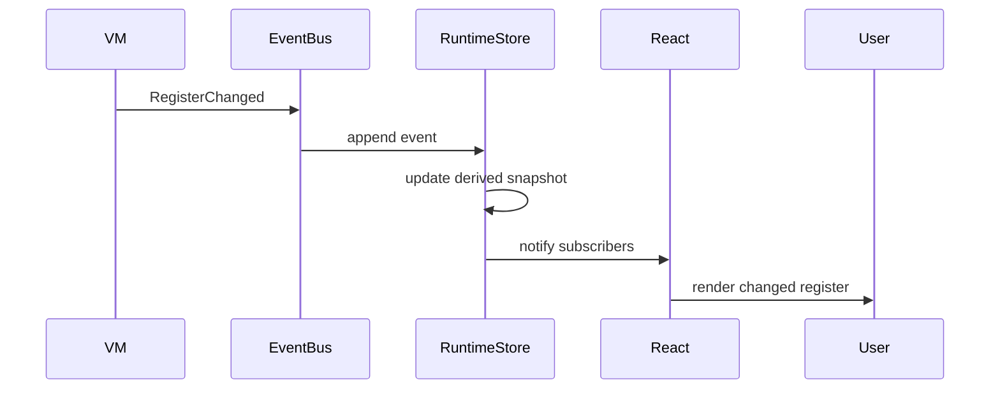

# NovaOS
# 07 - UI Design System & User Experience Specification

Version: 2.0

Status: Implementation Specification

Depends On:
- 01-product-requirements.md
- 02-system-architecture.md
- 03-virtual-machine.md
- 04-kernel-memory-processes-v2.md
- 05-filesystem-shell-v2.md
- 06-compiler-debugger-v2.md

Primary Packages:
- `packages/ui`
- `apps/web`
- `packages/terminal`
- `packages/debugger`
- `packages/simulator`
- `packages/shared`

---

# 1. Purpose

This document defines the NovaOS user experience, visual design system, workspace model, component architecture, accessibility requirements, interaction patterns, animation rules, state management boundaries, and implementation contracts for the browser application.

NovaOS is not merely a web UI wrapped around a simulator.

NovaOS is an operating systems laboratory where the UI is part of the learning model. The interface must make invisible machine behavior visible, understandable, and explorable.

The product should feel like a premium developer tool:

- dense but not chaotic
- technical but not intimidating
- beautiful but not decorative
- educational but not childish
- interactive but deterministic
- inspectable but performant

The target quality bar is:

> NovaOS should feel like VS Code, Chrome DevTools, Linear, Raycast, and a computer architecture lab merged into one polished browser application.

---

# 2. UX Mission

The UI mission is to turn operating system internals into direct manipulation.

A student should be able to see:

- a register changing
- a stack frame being pushed
- a process moving from ready to running
- a scheduler choosing the next process
- a syscall crossing from user space into kernel space
- a memory write mutating RAM
- a file command changing an inode tree
- a compiler lowering source code into bytecode
- a debugger mapping source lines to VM instructions

The user should not have to imagine what the operating system is doing.

NovaOS should show it.

---

# 3. Product Experience Principles

## 3.1 Make invisible state visible

Operating systems are usually hidden behind abstractions.

NovaOS should expose those abstractions.

Every important state transition should have:

- a visible representation
- a timeline event
- an inspectable payload
- a short explanation when selected

Examples:

- `ADD R2, R0, R1` should update R2 and pulse the register row.
- `malloc(32)` should highlight a heap block.
- a timer interrupt should appear in the interrupt log.
- a context switch should animate between process lanes.
- `cat file.txt` should generate filesystem read events.

---

## 3.2 Teach causality through motion

Animation is not decoration.

Animation should answer:

- what changed?
- where did it come from?
- where did it go?
- why did it happen?
- what changed next?

Use motion for educational causality:

- process moves from queue to CPU
- register receives ALU result
- stack pointer moves downward on push
- memory cell flashes on write
- syscall travels from process to kernel
- file operation updates tree and timeline

Avoid purely decorative motion that does not explain behavior.

---

## 3.3 Progressive disclosure

NovaOS should be usable by beginners and deep enough for advanced users.

Beginner view:

- friendly labels
- explanations
- examples
- guided tutorials
- high-level state

Advanced view:

- raw addresses
- bytecode
- CPU flags
- stack frames
- event payloads
- scheduler metadata
- memory permissions
- source maps

Use expandable panels, inspector drawers, hover cards, and command palette actions to reveal detail gradually.

---

## 3.4 Preserve simulation truth

UI components must not become the source of truth for simulation state.

The UI renders:

- domain snapshots
- typed events
- derived visual state
- user preferences
- layout state

The simulator, kernel, memory, filesystem, compiler, and debugger packages own their respective domain truth.

React state can own UI-only concerns such as:

- selected panel
- open tabs
- collapsed sections
- highlighted event
- scroll position
- layout sizes
- current theme

React state must not own:

- real process state
- authoritative memory contents
- authoritative register values
- authoritative filesystem tree
- authoritative debugger state

---

## 3.5 Keyboard-first, pointer-friendly

NovaOS should reward power users without excluding beginners.

Every important action should be accessible through:

- command palette
- keyboard shortcut
- visible button/menu
- context menu where appropriate

The application should be usable for a complete edit-compile-run-debug flow without touching the mouse.

---

## 3.6 Production polish

No placeholder-looking screens.

No random spacing.

No inconsistent borders.

No inaccessible contrast.

No unexplained empty panels.

No unhandled loading states.

No "something went wrong" errors.

No flickering state updates.

No hidden focus indicators.

No broken reduced-motion mode.

The application should feel demo-ready at every milestone.

---

# 4. Visual Direction

NovaOS should use a dark-first developer-tool aesthetic with equally strong light mode.

Inspiration:

- VS Code: editor density, panels, keyboard behavior
- Chrome DevTools: inspection, event details, runtime state
- Linear: clarity, visual hierarchy, keyboard-first interactions
- Vercel: restraint, spacing, premium surfaces
- Raycast: command palette and quick actions
- Arc Browser: subtle modern surfaces and transitions

Avoid:

- toy-like educational graphics
- excessive gradients
- random neon colors
- skeuomorphic computer imagery
- overly playful illustrations
- dashboard clutter
- marketing-page spacing inside the workspace

NovaOS should feel technical, precise, and calm.

---

# 5. Information Architecture

NovaOS has five major product areas:

1. Workspace
2. Simulator Runtime
3. Development Toolchain
4. Debugging and Timeline
5. Learning System

```mermaid
flowchart TD
    App["NovaOS Web App"] --> Workspace
    App --> Runtime["Runtime Views"]
    App --> Toolchain["Compiler / Assembler"]
    App --> Debugging["Debugger / Timeline"]
    App --> Learning["Tutorials / Examples"]

    Workspace --> Explorer["File Explorer"]
    Workspace --> Editor["Editor"]
    Workspace --> Terminal["Terminal"]
    Workspace --> Inspector["Inspector"]

    Runtime --> CPU["CPU Registers"]
    Runtime --> Memory["Memory Grid"]
    Runtime --> Processes["Process Table"]
    Runtime --> Scheduler["Scheduler Queue"]
    Runtime --> Kernel["Kernel Dashboard"]

    Toolchain --> Tokens["Tokens"]
    Toolchain --> AST["AST"]
    Toolchain --> IR["IR"]
    Toolchain --> Assembly["Assembly"]
    Toolchain --> Bytecode["Bytecode"]

    Debugging --> Breakpoints
    Debugging --> Watches
    Debugging --> CallStack["Call Stack"]
    Debugging --> Timeline

    Learning --> Tutorials
    Learning --> Examples
    Learning --> Glossary
```



---

# 6. Workspace Layout

Default desktop layout:

```text
┌──────────────────────────────────────────────────────────────────────────────┐
│ Top Bar: NovaOS | boot state | run controls | speed | scheduler | commands   │
├──────────────────┬────────────────────────────────────┬──────────────────────┤
│ Left Sidebar     │ Main Work Area                     │ Right Inspector      │
│                  │                                    │                      │
│ File Explorer    │ Editor / Visualization / Docs      │ Registers            │
│ Examples         │                                    │ Process Details      │
│ Tutorials        │                                    │ Memory Details       │
│                  │                                    │ Event Details        │
├──────────────────┴────────────────────────────────────┴──────────────────────┤
│ Bottom Panel: Terminal | Timeline | Problems | Compiler Output | Debug Console│
└──────────────────────────────────────────────────────────────────────────────┘
```

All major regions must be resizable.

Collapsible regions:

- left sidebar
- right inspector
- bottom panel
- top runtime controls where compact mode exists

Layout persistence:

- panel sizes
- collapsed state
- selected tabs
- theme
- density mode
- preferred number format
- reduced motion preference

Persist layout separately from simulation state.

---

# 7. Workspace Modes

NovaOS supports multiple modes. Modes are not separate pages; they are saved workspace arrangements with different panels emphasized.

## 7.1 Dashboard Mode

Purpose:

Provide immediate understanding of system status.

Panels:

- boot status
- CPU summary
- process summary
- memory summary
- recent timeline events
- quick start examples
- current tutorial step

Success criterion:

A first-time user understands what to click within 10 seconds.

---

## 7.2 Code Mode

Purpose:

Write source code and assembly.

Panels:

- file explorer
- Monaco editor
- compiler diagnostics
- terminal
- quick run controls

Primary flow:

1. Open file.
2. Edit code.
3. Save.
4. Compile.
5. Run.
6. Inspect output.

---

## 7.3 Debug Mode

Purpose:

Step through execution.

Panels:

- editor with current line highlight
- debugger toolbar
- registers
- memory
- call stack
- watch expressions
- breakpoints
- terminal output
- timeline

Primary flow:

1. Set breakpoint.
2. Start debug session.
3. Step through source or instructions.
4. Watch registers/memory mutate.
5. Rewind using timeline.

---

## 7.4 Kernel Mode

Purpose:

Teach operating system behavior.

Panels:

- process table
- scheduler visualization
- syscall log
- interrupt log
- context switch animation
- kernel state inspector

Primary flow:

1. Run multiple processes.
2. Switch scheduler.
3. Observe queue behavior.
4. Inspect context switches.

---

## 7.5 Memory Mode

Purpose:

Understand memory layout and mutation.

Panels:

- memory grid
- segment map
- stack viewer
- heap viewer
- allocation timeline
- address inspector

Primary flow:

1. Run memory example.
2. Observe stack/heap changes.
3. Trigger memory fault.
4. Inspect violation.

---

## 7.6 Toolchain Mode

Purpose:

Show compiler pipeline.

Panels:

- source editor
- tokens
- AST
- symbol table
- IR
- optimized IR
- assembly
- bytecode
- diagnostics

Primary flow:

1. Write Toy C.
2. Compile.
3. Inspect every transformation.
4. Map a source line to bytecode.

---

## 7.7 Timeline Mode

Purpose:

Replay and explain execution history.

Panels:

- event timeline
- event filters
- event detail inspector
- snapshot controls
- comparison view
- replay controls

Primary flow:

1. Run program.
2. Jump to crash.
3. Rewind.
4. Inspect prior memory/register state.

---

# 8. Navigation Model

NovaOS should support:

- workspace tabs/modes
- command palette
- quick open
- file breadcrumbs
- runtime object breadcrumbs
- deep links
- contextual inspector navigation

Example deep links:

```text
novaos://file/home/student/main.c
novaos://debug/session/3
novaos://process/12
novaos://memory/0x1A2F
novaos://timeline/event/1098
novaos://compiler/artifact/ir/main.c
```

Deep links do not need to map to actual browser protocol URLs in Version 1, but the internal navigation model should support equivalent targets.

Navigation target type:

```ts
export type NavigationTarget =
  | { kind: "file"; path: AbsolutePath; line?: number; column?: number }
  | { kind: "process"; pid: ProcessId }
  | { kind: "memory"; address: Address }
  | { kind: "timeline-event"; eventId: EventId }
  | { kind: "debug-session"; sessionId: DebugSessionId }
  | { kind: "compiler-artifact"; artifact: CompilerArtifactKind; file: AbsolutePath };
```

---

# 9. Design Token System

Design tokens live in:

```text
packages/ui/src/tokens/
```

Token categories:

- color
- typography
- spacing
- radius
- border
- shadow
- motion
- z-index
- opacity
- density
- runtime semantic colors

Components must consume tokens, not hardcoded raw values.

Raw hex values are allowed only inside token definitions.

---

# 10. Color System

Use semantic color tokens.

Core tokens:

```ts
export interface ColorTokens {
  background: string;
  backgroundSubtle: string;
  surface: string;
  surfaceElevated: string;
  surfaceInset: string;
  border: string;
  borderStrong: string;
  textPrimary: string;
  textSecondary: string;
  textMuted: string;
  accent: string;
  accentMuted: string;
  success: string;
  warning: string;
  danger: string;
  info: string;
  focus: string;
  selection: string;
}
```

Runtime semantic colors:

```ts
export interface RuntimeColorTokens {
  cpu: string;
  alu: string;
  register: string;
  memory: string;
  stack: string;
  heap: string;
  kernel: string;
  userProcess: string;
  filesystem: string;
  syscall: string;
  interrupt: string;
  scheduler: string;
  debugger: string;
  compiler: string;
  currentExecution: string;
  breakpoint: string;
  changedValue: string;
  fault: string;
}
```

These colors must meet accessibility requirements in dark and light mode.

Do not rely on color alone to communicate meaning. Use icons, labels, shape, or text as secondary signals.

---

# 11. Typography

Recommended type stack:

```text
Interface: Inter, Geist Sans, system-ui, sans-serif
Code: JetBrains Mono, Geist Mono, Menlo, Consolas, monospace
```

Type roles:

```ts
export type TypographyRole =
  | "display"
  | "heading"
  | "subheading"
  | "body"
  | "bodySmall"
  | "caption"
  | "code"
  | "codeSmall"
  | "label"
  | "badge";
```

Rules:

- code panels use monospace
- data tables use tabular numbers
- addresses should use monospace
- registers should use monospace
- timeline descriptions may use interface font
- dense panels should remain readable at 13px or greater

---

# 12. Spacing, Radius, and Density

Use an 8px base grid with half steps.

Spacing scale:

```text
0: 0px
1: 4px
2: 8px
3: 12px
4: 16px
5: 24px
6: 32px
7: 48px
8: 64px
```

Density modes:

```ts
export type DensityMode = "comfortable" | "compact";
```

Compact mode affects:

- table row height
- panel header height
- tree item height
- terminal line height
- inspector spacing

Comfortable mode is default for learning.

Compact mode is useful for power users.

---

# 13. Surface and Elevation Model

NovaOS uses layered surfaces.

Surface hierarchy:

1. app background
2. panel background
3. panel header
4. card
5. popover
6. modal
7. command palette

Each layer should have consistent:

- background
- border
- shadow/elevation
- radius
- blur if used

Avoid excessive glassmorphism.

Developer tools should remain crisp and legible.

---

# 14. Component Architecture

Generic reusable UI components live in:

```text
packages/ui/
```

Application-specific components live in:

```text
apps/web/components/
```

Domain-specific visualizations may live in feature folders:

```text
apps/web/features/memory/
apps/web/features/debugger/
apps/web/features/kernel/
apps/web/features/compiler/
apps/web/features/filesystem/
```

Rules:

- `packages/ui` must not import simulator packages.
- `packages/ui` must not know about NovaOS domain concepts.
- Domain visualizations may import both UI primitives and domain types.
- Components should be small and composable.
- Complex panels should separate data adapters from presentational components.

---

# 15. Generic UI Component Inventory

Required primitives:

- Button
- IconButton
- Input
- TextArea
- Select
- Checkbox
- Switch
- RadioGroup
- Slider
- Tabs
- Panel
- PanelHeader
- SplitPane
- ResizablePanel
- Toolbar
- Tooltip
- Popover
- Dialog
- Drawer
- Menu
- ContextMenu
- CommandPalette
- Breadcrumb
- TreeView
- DataTable
- VirtualList
- Timeline
- Badge
- StatusIndicator
- Progress
- Spinner
- Skeleton
- Toast
- EmptyState
- ErrorState
- LoadingState
- KeyboardShortcut
- CodeBlock

Each component must support:

- typed props
- ref forwarding where useful
- keyboard behavior
- focus states
- ARIA attributes
- disabled state
- loading state where applicable
- dark/light/high-contrast themes
- composition without domain coupling

---

# 16. NovaOS-Specific Component Inventory

Required runtime components:

- BootSequence
- VMControlBar
- CPUStatusCard
- RegisterViewer
- FlagsViewer
- InstructionPipelineViewer
- MemoryGrid
- MemorySegmentMap
- StackViewer
- HeapViewer
- ProcessTable
- ProcessDetailPanel
- SchedulerQueue
- ContextSwitchAnimation
- KernelDashboard
- SyscallLog
- InterruptLog
- FileExplorer
- FileMetadataInspector
- TerminalView
- EditorWorkspace
- CompilerInspector
- TokenViewer
- ASTViewer
- IRViewer
- AssemblyViewer
- BytecodeViewer
- SourceMapInspector
- DebuggerToolbar
- BreakpointList
- WatchPanel
- CallStackPanel
- EventTimeline
- TimelineEventInspector
- TutorialOverlay
- ExampleGallery
- GlossaryPanel

Each domain component should have a clear data contract and should be testable with mock snapshots/events.

---

# 17. App State Management

Separate state into five categories.

## 17.1 Domain simulation state

Owned by simulator packages.

Examples:

- CPU registers
- memory contents
- process table
- filesystem tree
- debugger state
- timeline events

React consumes snapshots and events.

## 17.2 UI layout state

Owned by app store.

Examples:

- panel sizes
- collapsed panels
- active mode
- active bottom tab
- active inspector tab

## 17.3 Editor state

Owned by editor store.

Examples:

- open tabs
- active file
- unsaved changes
- cursor position
- selected diagnostics

File contents still come from filesystem APIs.

## 17.4 Visualization state

Owned by visualization store.

Examples:

- selected memory address
- selected event
- highlighted process
- selected register format
- active filters
- timeline cursor

## 17.5 User preferences

Owned by preferences store.

Examples:

- theme
- density
- reduced motion
- number format
- auto-save
- tutorial hints enabled

Recommended store files:

```text
apps/web/stores/
  layout-store.ts
  editor-store.ts
  visualization-store.ts
  preferences-store.ts
  navigation-store.ts
```

---

# 18. Event-Driven Rendering

The UI should primarily update through domain events and snapshots.

Event flow:



Rules:

- batch high-frequency events
- throttle visual updates during fast run mode
- preserve every event in timeline if trace mode allows
- do not re-render whole workspace on every instruction
- use selectors to subscribe to small slices of state
- virtualize large lists and grids

---

# 19. Top Bar

The top bar is always visible.

Contents:

- NovaOS logo/name
- workspace mode selector
- boot status
- run controls
- current scheduler selector
- simulation speed selector
- command palette trigger
- layout controls
- settings menu

Run controls:

- Boot
- Run
- Pause
- Step
- Stop
- Restart
- Speed

Keyboard equivalents should be shown in tooltips.

Boot status states:

- Not Booted
- Booting
- Ready
- Running
- Paused
- Faulted
- Halted

Faulted status must be visually obvious and clickable to inspect fault details.

---

# 20. Command Palette

Shortcut:

```text
Cmd+K / Ctrl+K
```

The command palette is the fastest way to navigate NovaOS.

Command categories:

- System
- Files
- Runtime
- Debugger
- Compiler
- View
- Tutorials
- Settings

Required commands:

- Boot NovaOS
- Run current file
- Compile current file
- Debug current file
- Pause simulation
- Step instruction
- Step source line
- Open file
- Quick open
- Go to memory address
- Go to process
- Go to event
- Toggle terminal
- Toggle file explorer
- Toggle inspector
- Change scheduler
- Reset filesystem
- Open tutorial
- Open example
- Export trace
- Import filesystem
- Switch theme
- Toggle reduced motion

Command type:

```ts
export interface CommandAction {
  id: string;
  title: string;
  subtitle?: string;
  category: CommandCategory;
  keywords: string[];
  shortcut?: string;
  enabled: boolean;
  run(context: CommandContext): Promise<void> | void;
}
```

The command palette should support fuzzy search and recently used commands.

---

# 21. File Explorer UX

The file explorer displays the virtual filesystem.

Required behavior:

- nested tree
- expand/collapse directories
- active file highlight
- unsaved file indicator
- right-click context menu
- new file
- new folder
- rename
- delete
- duplicate
- reveal active file
- drag and drop move
- file icons
- read-only indicator
- permission tooltip

Context menu actions:

- Open
- Rename
- Delete
- Duplicate
- Copy path
- Reveal in terminal
- Compile if source file
- Run if executable/assembly
- Debug if runnable
- Inspect metadata

The file explorer must listen to filesystem events and update live.

It must not own a separate authoritative file tree.

---

# 22. Editor UX

Use Monaco Editor.

Required features:

- open tabs
- close tabs
- dirty state indicator
- save
- save all
- syntax highlighting for Toy C
- syntax highlighting for NovaASM
- diagnostics gutter
- breakpoint gutter
- current execution line highlight
- inline error messages
- hover cards for symbols/registers
- quick fixes where feasible
- go to source map target
- reveal bytecode for current line

Editor actions:

- compile file
- run file
- debug file
- format file
- open compiler inspector
- reveal in file explorer
- copy path

Breakpoint behavior:

- clicking gutter toggles line breakpoint
- disabled breakpoint appears muted
- unresolved breakpoint shows warning indicator

---

# 23. Terminal UX

The terminal should feel like a real developer terminal but remain educational.

Required features:

- prompt
- command history
- autocomplete
- multiline output
- stdout/stderr styling
- clickable file paths
- clickable process IDs
- clickable memory addresses
- Ctrl+C interrupt
- Ctrl+L clear
- Ctrl+R history search
- command status indicator
- inline explanations for educational mode

Prompt format:

```text
student@novaos:/home/student$
```

Error output should be helpful and actionable.

Example:

```text
Command not found: rn
Hint: Did you mean `run`?
```

---

# 24. MemoryGrid UX

The MemoryGrid is a flagship visualization.

Requirements:

- virtualized rendering
- address labels
- byte values in hex
- ASCII preview option
- segment color overlays
- owner process highlighting
- changed-cell pulse
- read/write markers
- selected address inspector
- search by address
- jump to stack
- jump to heap
- jump to code
- filter by process
- filter by segment
- show permissions
- show last write event

Visual states:

- free
- kernel
- code
- data
- heap
- stack
- memory-mapped I/O
- recently read
- recently written
- selected
- breakpoint
- violation

Large memory must use windowing.

Do not render every memory cell as a full React component for large RAM.

---

# 25. RegisterViewer UX

Displays:

- register name
- current value
- previous value
- delta
- binary/decimal/hex toggle
- description
- last changed event
- source instruction that changed it

Changed registers pulse briefly.

PC and SP receive special visual emphasis.

FLAGS should display individual bit badges:

- Z
- C
- O
- N
- I

Hovering a flag explains it.

---

# 26. ProcessTable UX

Columns:

- PID
- name
- state
- priority
- CPU ticks
- memory bytes
- instructions executed
- open files
- current instruction

Process states use both badge text and icon/shape.

Rows are clickable.

Selecting a process opens inspector with:

- PCB
- memory map
- register snapshot
- open file descriptors
- scheduling metadata
- accounting
- fault/exit info

Process table must handle at least 100 processes.

---

# 27. Scheduler Visualization UX

Scheduler visualization adapts to algorithm.

FIFO:

- single queue ordered by admission

Round Robin:

- circular queue
- current quantum progress

Priority:

- lanes by priority

SJF:

- bars showing estimated burst

Lottery:

- ticket distribution and deterministic draw result

Context switch animation:

```text
PID 4 running → save registers → scheduler decision → PID 7 running
```

The animation should be skippable and respect reduced motion.

---

# 28. Debugger UX

Debugger panels:

- debugger toolbar
- source editor
- current instruction
- breakpoints
- watches
- call stack
- registers
- memory
- timeline

Toolbar actions:

- Continue
- Pause
- Step Into
- Step Over
- Step Out
- Step Instruction
- Restart
- Stop

Breakpoint panel:

- enable/disable
- remove
- condition
- resolved address list
- hit count

Watch panel:

- add expression
- edit expression
- remove expression
- show latest value
- show diagnostic if unavailable

Call stack:

- function name
- source line
- return address
- local variables
- arguments

---

# 29. Compiler Inspector UX

Compiler inspector shows every compilation stage.

Tabs:

- Diagnostics
- Tokens
- AST
- Symbol Table
- IR
- Optimized IR
- Assembly
- Bytecode
- Source Map

Important behavior:

- clicking source line highlights related AST/IR/assembly/bytecode
- clicking bytecode highlights source line
- diagnostics are clickable
- optimization explanations are visible
- source map entries are inspectable

This is a key differentiator for NovaOS.

---

# 30. Timeline UX

Timeline is the historical truth of the simulation.

Event categories:

- CPU
- Memory
- Kernel
- Scheduler
- Filesystem
- Shell
- Compiler
- Debugger
- User Action
- Error

Features:

- event list
- category filters
- search
- grouping by correlation ID
- jump to event
- scrubber
- snapshot markers
- replay controls
- export trace
- compare state at two events

Timeline event detail should show:

- human-readable explanation
- raw payload
- related events
- affected objects
- navigation actions

Example explanation:

```text
Process 3 invoked syscall `print`.
The kernel copied the value in R0 to terminal stdout.
```

---

# 31. Inspector Panel

The inspector is context-sensitive.

Selection targets:

- file
- process
- memory address
- memory segment
- register
- instruction
- timeline event
- syscall
- interrupt
- compiler diagnostic
- AST node
- IR instruction
- bytecode instruction

Inspector structure:

- summary
- properties
- related events
- actions
- raw data

The inspector prevents the main workspace from becoming cluttered.

---

# 32. Boot Sequence UX

Boot should be visually memorable.

Stages:

1. Initialize VM clock
2. Initialize CPU
3. Allocate kernel memory
4. Mount filesystem
5. Register syscalls
6. Start scheduler
7. Spawn init process
8. Spawn shell process
9. Ready

Each stage shows:

- label
- status
- duration
- emitted event count
- short explanation

Boot must be skippable.

Reduced motion mode should replace animation with status list.

---

# 33. Tutorial System UX

Tutorials are interactive overlays and guided workflows.

Tutorial examples:

- Your First Program
- How Registers Work
- Stack vs Heap
- Scheduling Algorithms
- System Calls
- Debugging a Crash
- Understanding Compilation
- Memory Access Violations
- Time-Travel Debugging

Tutorial step type:

```ts
export interface TutorialStep {
  id: string;
  title: string;
  body: string;
  target?: TutorialTarget;
  requiredAction?: TutorialRequiredAction;
  validation?: TutorialValidation;
}
```

Tutorials should be non-blocking when possible.

Users can pause, resume, or exit.

---

# 34. Example Gallery UX

Example categories:

- Beginner
- Assembly
- Toy C
- Debugging
- Scheduling
- Memory
- Filesystem
- Compiler
- Failure Cases

Each example includes:

- title
- description
- source code
- expected output
- concepts taught
- suggested inspection steps
- run/debug buttons

Examples should be stored in the virtual filesystem under:

```text
/usr/examples/
```

---

# 35. Empty States

Every empty panel must teach or guide.

Bad:

```text
No data.
```

Good:

```text
No process is running.
Boot NovaOS or run a program to create a process.
```

Required empty states:

- no open file
- no running process
- no debugger session
- no timeline events
- no compiler diagnostics
- no breakpoints
- no watch expressions
- no search results
- no filesystem selection

Empty states should include a primary action where appropriate.

---

# 36. Error States

Errors should be educational.

Error content should include:

- what happened
- where it happened
- why it matters
- what to do next

Example:

```text
Segmentation fault at 0x41AF.

Process 3 attempted to read memory outside its allocated heap segment.

Open Memory View to inspect the process memory map, or rewind the timeline to the previous memory write.
```

Avoid vague errors.

Never show raw stack traces to normal users unless developer mode is enabled.

---

# 37. Loading States

Prefer meaningful loading states over generic spinners.

Examples:

- Compiling source
- Resolving labels
- Encoding bytecode
- Booting kernel
- Restoring snapshot
- Replaying timeline
- Mounting filesystem
- Loading examples

For quick operations under 200ms, avoid flashing loaders.

---

# 38. Motion Design

Allowed animation uses:

- memory mutation
- register update
- process queue movement
- context switch
- syscall flow
- boot stages
- timeline scrub
- panel transitions
- file tree changes

Timing guidance:

```text
Fast feedback: 80-120ms
Panel transition: 150-220ms
Runtime state pulse: 180-300ms
Educational animation: 300-700ms
Boot stage: 300-800ms
```

Reduced motion:

- disable movement-based animations
- preserve opacity/outline changes if acceptable
- provide text status for animated concepts

---

# 39. Accessibility Requirements

NovaOS must support:

- keyboard navigation
- visible focus outlines
- semantic HTML
- ARIA labels
- screen reader summaries
- high contrast theme
- reduced motion
- resizable text
- non-color-only status indicators
- focus trapping in dialogs
- escape-to-close for popovers/dialogs
- roving tabindex where appropriate

Complex visualizations require text alternatives.

Memory cell screen reader summary example:

```text
Address 0x1A02. Value 0F. Segment heap. Owner process 4. Last written by instruction 892.
```

Scheduler summary example:

```text
Round Robin scheduler. Process 3 is running. Three ready processes remain in queue.
```

---

# 40. Keyboard Shortcuts

Global shortcuts:

| Shortcut | Action |
|---|---|
| `Cmd/Ctrl+K` | Command palette |
| `Cmd/Ctrl+P` | Quick open |
| `Cmd/Ctrl+B` | Toggle file explorer |
| `Cmd/Ctrl+J` | Toggle terminal |
| `Cmd/Ctrl+Shift+D` | Debug mode |
| `Cmd/Ctrl+S` | Save current file |
| `F5` | Run/continue |
| `Shift+F5` | Stop |
| `F9` | Toggle breakpoint |
| `F10` | Step over |
| `F11` | Step into |
| `Shift+F11` | Step out |
| `Esc` | Dismiss overlay/popover |

Shortcuts should be discoverable through command palette and tooltips.

Future versions should support customizable keybindings.

---

# 41. Responsive Behavior

Primary target:

- desktop and laptop
- minimum comfortable width: 1200px
- minimum supported width: 1024px

Tablet:

- exploration mode
- tutorials
- read-only examples
- simplified workspace

Mobile:

- documentation
- example previews
- lightweight demo mode
- not full simulator workspace

The full multi-panel IDE is not required to be comfortable on phone screens.

---

# 42. Performance Requirements

UI targets:

```text
Initial app shell render: < 2s on normal laptop
Boot animation: < 500ms unless educational mode extends it
Panel interaction latency: < 50ms
Instruction step visual update: < 16ms target
Memory grid scroll: 60 FPS
Timeline with 10,000 events: usable
Process table with 100 processes: usable
Command palette search: < 100ms
Autocomplete: < 100ms
```

Strategies:

- virtualize memory grid
- virtualize timeline
- virtualize terminal output
- use selectors to avoid broad re-renders
- batch simulator events
- throttle high-frequency visual updates
- move heavy compilation/replay to Web Workers if needed
- memoize derived visual summaries
- avoid rendering huge raw payloads unless expanded

---

# 43. Web Worker Strategy

Potential worker responsibilities:

- compiler pipeline
- assembler
- simulator run loop in fast mode
- replay reconstruction
- large trace export/import

Worker communication must use serializable messages.

Do not pass functions, class instances, or DOM references.

Worker protocol:

```ts
export interface WorkerRequest {
  id: string;
  type: string;
  payload: unknown;
}

export interface WorkerResponse {
  id: string;
  type: "success" | "error" | "event";
  payload: unknown;
}
```

---

# 44. Testing Strategy

## Component tests

Required for:

- Button
- CommandPalette
- TreeView
- DataTable
- TerminalView
- RegisterViewer
- ProcessTable
- MemoryGrid windowing
- Timeline filters
- BreakpointList

## Interaction tests

Required flows:

- open command palette and run command
- open file from explorer
- edit and save file
- run command in terminal
- set breakpoint
- step debugger
- inspect memory address
- switch scheduler
- filter timeline

## Accessibility tests

Required:

- keyboard navigation
- focus management
- aria labels for visualizations
- reduced motion behavior
- high contrast theme
- no obvious color contrast failures

## E2E tests

Critical flows:

1. Boot NovaOS.
2. Open example.
3. Compile example.
4. Run example.
5. Debug example.
6. Step once.
7. Inspect register.
8. Inspect memory.
9. View timeline.
10. Reset simulator.

---

# 45. Design System Package Structure

```text
packages/ui/
  src/
    tokens/
      colors.ts
      runtime-colors.ts
      typography.ts
      spacing.ts
      radius.ts
      shadows.ts
      motion.ts
      z-index.ts
      density.ts
    primitives/
      Button.tsx
      IconButton.tsx
      Input.tsx
      Select.tsx
      Checkbox.tsx
      Switch.tsx
      Tabs.tsx
      Dialog.tsx
      Tooltip.tsx
      Popover.tsx
      Menu.tsx
    layout/
      Panel.tsx
      PanelHeader.tsx
      SplitPane.tsx
      ResizablePanel.tsx
      Toolbar.tsx
    data/
      DataTable.tsx
      TreeView.tsx
      VirtualList.tsx
      Timeline.tsx
    feedback/
      Toast.tsx
      EmptyState.tsx
      ErrorState.tsx
      LoadingState.tsx
      Skeleton.tsx
      Badge.tsx
      StatusIndicator.tsx
    command/
      CommandPalette.tsx
      QuickOpen.tsx
    hooks/
      useReducedMotion.ts
      useKeyboardShortcut.ts
      useFocusTrap.ts
    index.ts
```

---

# 46. Web App Structure

```text
apps/web/
  app/
    layout.tsx
    page.tsx
  components/
    app-shell/
    workspace/
    navigation/
    settings/
  features/
    boot/
    compiler/
    debugger/
    editor/
    filesystem/
    kernel/
    memory/
    processes/
    scheduler/
    terminal/
    timeline/
    tutorials/
  stores/
    layout-store.ts
    editor-store.ts
    visualization-store.ts
    preferences-store.ts
    navigation-store.ts
  workers/
    compiler-worker.ts
    simulator-worker.ts
  styles/
    globals.css
```

---

# 47. Implementation Order

Recommended order:

1. Design tokens.
2. Basic UI primitives.
3. App shell and layout.
4. Command palette.
5. File explorer skeleton.
6. Editor integration.
7. Terminal UI.
8. Runtime control bar.
9. Register viewer.
10. Process table.
11. Memory grid prototype.
12. Timeline list.
13. Debugger toolbar.
14. Compiler inspector.
15. Kernel dashboard.
16. Scheduler visualization.
17. Full memory grid virtualization.
18. Tutorial overlay.
19. Example gallery.
20. Accessibility pass.
21. Performance pass.
22. Final visual polish.

Do not build complex visualizations before stable domain snapshots exist.

Use typed mock snapshots while runtime packages are in progress, but mocks must match real contracts.

---

# 48. Agent Ownership Recommendations

Relevant agents:

- Agent 40: Design System Agent
- Agent 41: Workspace Layout Agent
- Agent 42: Editor Agent
- Agent 43: Terminal UI Agent
- Agent 44: Memory Visualization Agent
- Agent 45: CPU and Process UI Agent
- Agent 46: Debugger UI Agent
- Agent 47: Tutorial and Examples Agent
- Agent 49: Performance and Accessibility Agent
- Agent 50: Release and Demo Agent

Suggested sequencing:

1. Design system and layout first.
2. Editor, terminal, and command palette next.
3. Runtime panels after CPU/kernel/memory contracts stabilize.
4. Debugger UI after debugger core and source maps.
5. Tutorials after examples and basic workflows exist.
6. Accessibility and performance agents active throughout UI phase.

---

# 49. Minimum Viable UI Demo

The MVP UI demo should support:

1. User opens NovaOS.
2. Boot sequence runs.
3. Terminal appears.
4. File explorer shows `/home/student`.
5. User opens `hello.asm`.
6. Editor displays source.
7. User clicks Run.
8. Terminal prints output.
9. Register viewer updates.
10. Memory grid shows changes.
11. Timeline records events.
12. User steps one instruction.
13. User clicks memory address and sees inspector details.

This demo must feel polished.

Even if the underlying simulator is small, the UI should communicate the vision clearly.

---

# 50. Definition of Done

The UI design system and user experience are complete when:

- design tokens exist and are consistently used
- generic UI components are typed and accessible
- workspace layout is resizable and persistent
- command palette supports core actions
- file explorer syncs with filesystem events
- editor supports Toy C and NovaASM workflows
- terminal supports history, autocomplete, clear, interrupt, and links
- register viewer updates from runtime events
- process table reflects kernel state
- memory grid is virtualized and inspectable
- scheduler visualization adapts to algorithms
- debugger UI supports stepping, breakpoints, watches, and call stack
- compiler inspector shows all pipeline artifacts
- timeline supports filtering and event inspection
- empty, loading, and error states are handled
- dark, light, and high contrast themes work
- keyboard shortcuts cover core workflows
- reduced motion mode works
- accessibility requirements are tested
- performance budgets are respected
- no domain truth is stored only in React UI state
- UI packages respect architecture boundaries
- the app is demo-ready for recruiters, professors, and students

---

# 51. Final Principle

The NovaOS UI is not a skin.

It is the learning environment.

A great NovaOS interface should make users feel like they can reach into the computer and touch the operating system.

Every panel, animation, tooltip, command, and inspector should help reveal how programs become processes, how processes use memory, how kernels enforce rules, and how machines execute instructions.

That is the product.
