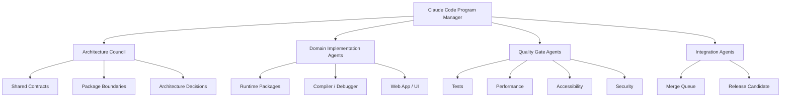
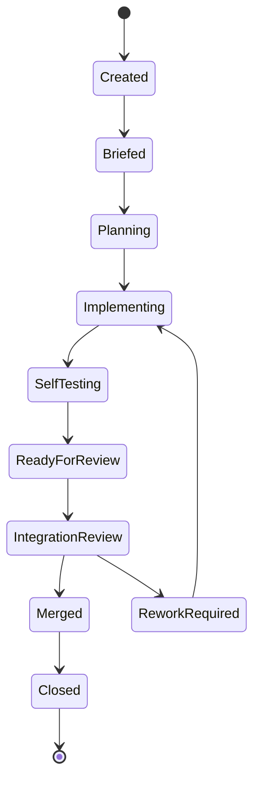
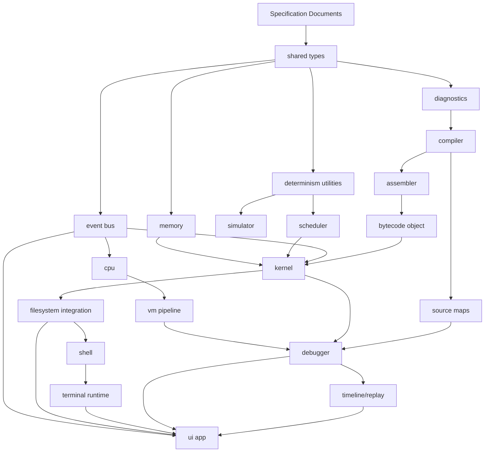

# NovaOS
# 08 - Claude Code / UltraCode 50-Agent Orchestration Plan

Version: 2.0

Status: Execution Specification

Depends On:
- 01-product-requirements.md
- 02-system-architecture.md
- 03-virtual-machine.md
- 04-kernel-memory-processes-v2.md
- 05-filesystem-shell-v2.md
- 06-compiler-debugger-v2.md
- 07-ui-design-system-v2.md

Primary Consumer:
- Claude Code running with UltraCode-style multi-agent orchestration

---

# 1. Purpose

This document tells Claude Code how to organize, sequence, supervise, and integrate up to 50 specialized agents to build NovaOS.

NovaOS is large enough to benefit from many agents, but only if the work is decomposed with discipline.

The goal is not to spawn 50 agents immediately.

The goal is to behave like a serious engineering organization:

- define architecture first
- establish contracts first
- assign clear ownership
- parallelize only safe work
- continuously integrate
- reject untested code
- keep main green
- preserve product coherence
- avoid duplicate implementations
- ship milestone by milestone

Claude Code must act as:

- technical program manager
- staff engineer
- architect
- integration lead
- code reviewer
- release manager

---

# 2. Core Instruction to Claude Code

When given the NovaOS specification set, Claude Code must first read all documents.

Required documents:

- `01-product-requirements.md`
- `02-system-architecture.md`
- `03-virtual-machine.md`
- `04-kernel-memory-processes-v2.md`
- `05-filesystem-shell-v2.md`
- `06-compiler-debugger-v2.md`
- `07-ui-design-system-v2.md`
- `08-agent-orchestration-v2.md`
- `09-testing-devops.md`
- `10-roadmap.md`

Claude Code must then:

1. Summarize the project objective.
2. Build an architectural dependency graph.
3. Create a task registry.
4. Define package ownership.
5. Define shared contracts.
6. Define quality gates.
7. Activate only the first wave of agents.
8. Track all active agents.
9. Merge incrementally.
10. Stop and resolve architecture conflicts early.

Claude Code must not:

1. Spawn all 50 agents at once.
2. Let agents modify the same files without coordination.
3. Let UI agents invent fake runtime behavior.
4. Let runtime agents import UI code.
5. Merge code without tests.
6. Merge code that breaks typecheck, lint, build, or tests.
7. Change public contracts silently.
8. Use random third-party libraries without justification.
9. Create placeholder implementations and call them done.
10. Optimize for speed at the expense of maintainability.

---

# 3. Operating Model

The orchestration model has five layers.



Claude Code remains final authority.

Agents execute workstreams, but Claude Code resolves:

- unclear requirements
- public API changes
- ownership conflicts
- failing gates
- merge conflicts
- milestone scope decisions

---

# 4. Agent Lifecycle

Every agent follows the same lifecycle.



No agent may skip:

- planning
- self-test
- integration notes
- documentation updates
- ownership boundary check

---

# 5. Agent Brief Template

Every agent must receive a written brief.

```markdown
# Agent Brief

## Agent ID

## Role

## Mission

## Context Documents

## Owned Packages / Files

## Allowed Dependencies

## Forbidden Dependencies

## Required Deliverables

## Required Tests

## Public Interfaces To Preserve

## Events To Emit

## Snapshots To Expose

## Integration Contracts

## Definition of Done

## Risks

## Reporting Format
```

Bad brief:

```text
Work on the frontend.
```

Good brief:

```text
Implement `RegisterViewer` using the `RegisterSnapshot` contract.
Do not read CPU internals directly.
Consume only runtime snapshots and `RegisterChanged` events.
Include hex/decimal/binary toggle, changed-value animation, keyboard selection, and tests.
```

---

# 6. Global Engineering Rules

All agents must obey these rules.

## 6.1 TypeScript

- strict TypeScript
- no implicit `any`
- no untyped public APIs
- no broad type assertions without validation
- no exported unstable internals
- prefer discriminated unions for events and diagnostics
- use branded types for IDs and addresses

## 6.2 Package Boundaries

- each package exports public API from `src/index.ts`
- agents may not import internal files from other packages
- domain packages must not import React
- domain packages must not import browser DOM APIs
- UI packages must not own domain truth
- shared package must remain minimal and stable

## 6.3 Testing

- tests are required for core logic
- compiler and assembler need golden tests
- simulator needs deterministic replay tests
- UI needs interaction and accessibility tests
- critical E2E flows must pass before release

## 6.4 Documentation

- public APIs documented
- package README exists
- ADR required for major architecture changes
- nontrivial algorithms explained
- user-facing features documented

## 6.5 Dependencies

- avoid unnecessary dependencies
- justify every dependency
- prefer small well-maintained libraries
- no dependency for simple utilities
- no package that compromises browser-only execution

---

# 7. Worktree and Branch Strategy

Recommended branch pattern:

```text
agent/<agent-id>/<task-slug>
```

Examples:

```text
agent/11-cpu-registers/register-file
agent/21-scheduler/round-robin
agent/44-memory-ui/virtualized-grid
```

Merge path:

```text
Agent branch
  ↓
Agent self-test
  ↓
Quality review
  ↓
Integration branch
  ↓
Full CI
  ↓
Main
```

Main must always be buildable.

If Claude Code has worktree support, each major agent should work in its own worktree.

If worktree support is unavailable, Claude Code must simulate ownership by applying one agent's changes at a time and tracking file ownership explicitly.

---

# 8. Status Reporting Protocol

Every agent reports using this structure.

```markdown
## Status

Not Started | In Progress | Blocked | Ready for Review | Done

## Completed

- item

## Files Changed

- path

## Tests Added

- test

## Public APIs Changed

- api

## Events Added

- event

## Integration Notes

- note

## Blockers

- blocker

## Risks

- risk
```

Claude Code should maintain a dashboard summary:

- active agents
- completed agents
- blocked agents
- merge queue
- failing tests
- public API changes
- unresolved risks
- current milestone

---

# 9. Dependency Graph

Build in dependency order.



Do not implement final integrated UI before the runtime contracts are stable.

UI agents may use typed mocks only if those mocks are generated from contracts.

---

# 10. Phase-Based Scaling Strategy

## Phase 0: Planning

Target active agents: 3-5

Goals:

- read all specs
- create task registry
- define package ownership
- define initial contracts
- identify dependency graph
- create implementation milestones

No feature implementation yet except repository setup if needed.

---

## Phase 1: Foundation

Target active agents: 8-12

Goals:

- monorepo
- workspace config
- shared types
- event bus
- diagnostics
- deterministic utilities
- testing harness
- CI skeleton
- design tokens skeleton

Exit criteria:

- repo builds
- tests run
- packages compile
- event bus works
- shared types documented

---

## Phase 2: Core Runtime

Target active agents: 15-25

Goals:

- CPU registers
- instruction decoder
- instruction handlers
- VM pipeline
- memory core
- allocator
- stack/heap
- kernel boot
- process manager
- scheduler
- syscalls
- interrupts

Exit criteria:

- minimal bytecode executes
- process can run and exit
- memory events emit
- context switch works
- deterministic tests pass

---

## Phase 3: Filesystem and Shell

Target active agents: 15-25

Goals:

- VFS
- path resolver
- file operations
- persistence
- shell lexer/parser
- built-ins
- terminal runtime

Exit criteria:

- terminal commands work
- file explorer contract stable
- filesystem survives refresh
- kernel commands inspect process/memory state

---

## Phase 4: Toolchain and Debugger

Target active agents: 20-35

Goals:

- Toy C lexer/parser
- semantic analysis
- IR
- assembly generation
- assembler
- bytecode object
- source maps
- debugger state machine
- breakpoints
- watches
- timeline/replay

Exit criteria:

- `.asm` and `.c` compile
- debugger can step
- breakpoints work
- source maps connect code to bytecode
- timeline replay works for demo programs

---

## Phase 5: UI Integration

Target active agents: 25-40

Goals:

- app shell
- workspace
- editor
- terminal UI
- file explorer
- register viewer
- memory grid
- process table
- scheduler view
- compiler inspector
- debugger UI
- timeline UI

Exit criteria:

- full edit-compile-run-debug flow works
- visualizations update from real events
- UI is responsive
- keyboard shortcuts work

---

## Phase 6: Polish and Release

Target active agents: 30-50

Goals:

- examples
- tutorials
- docs
- accessibility
- performance
- tests
- release notes
- screenshots
- deployment
- final README

This is the phase where 50 agents may be justified because many tasks are independent.

---

# 11. The 50-Agent Roster

Not all agents are active at once.

The roster defines maximum specialization.

---

## Group A: Leadership and Architecture

### Agent 01: Program Manager

Mission:

Own the milestone plan, task registry, agent status, risk register, and merge queue.

Owned artifacts:

- project plan
- task registry
- milestone checklist
- risk register
- integration schedule

Deliverables:

- current milestone status
- blocked task list
- next activation wave
- release readiness report

---

### Agent 02: Staff Architect

Mission:

Own global architecture, package boundaries, dependency direction, and ADRs.

Owned artifacts:

- architecture map
- package boundary rules
- ADRs
- dependency graph

Review focus:

- no circular dependencies
- no domain/UI coupling
- no god packages
- public contracts are coherent

---

### Agent 03: API Contract Architect

Mission:

Define stable contracts between packages.

Owned artifacts:

- public interfaces
- event payload schemas
- snapshot contracts
- diagnostic contracts

Review focus:

- compatibility
- serialization
- deterministic replay
- versioning

---

### Agent 04: Monorepo Infrastructure Agent

Mission:

Create and maintain repository structure.

Owned areas:

- package manager config
- workspace config
- TypeScript references
- build scripts
- lint scripts
- path aliases

Deliverables:

- working monorepo
- package scaffolds
- build graph

---

### Agent 05: Documentation Lead

Mission:

Own docs quality and consistency.

Owned areas:

- docs index
- glossary
- contributor guide
- package README templates
- tutorial copy standards

Deliverables:

- docs structure
- glossary
- ADR template
- user guide outline

---

## Group B: Shared Runtime Foundation

### Agent 06: Shared Types Agent

Mission:

Implement canonical primitives.

Owned packages:

- `packages/shared/src/types`

Deliverables:

- branded IDs
- addresses
- bytes/words
- result type
- source spans
- diagnostics base types

---

### Agent 07: Event Bus Agent

Mission:

Implement typed event bus.

Owned packages:

- `packages/shared/src/events`

Deliverables:

- event union
- event emitter
- event recorder
- event serialization
- correlation IDs

---

### Agent 08: Determinism Agent

Mission:

Guarantee deterministic simulation utilities.

Owned areas:

- deterministic clock
- seeded PRNG
- deterministic ordering helpers
- replay constraints

Deliverables:

- deterministic utilities
- tests proving same inputs produce same outputs

---

### Agent 09: Error and Diagnostic Agent

Mission:

Create unified error model.

Owned areas:

- runtime faults
- compiler diagnostics
- filesystem diagnostics
- user-facing error format

Deliverables:

- error taxonomy
- diagnostic helpers
- golden diagnostic tests

---

### Agent 10: Serialization and Snapshot Agent

Mission:

Own versioned snapshots.

Owned areas:

- snapshot schema
- migration helpers
- import/export contracts
- serialization tests

Deliverables:

- runtime snapshot format
- filesystem snapshot format
- timeline snapshot format

---

## Group C: CPU and VM

### Agent 11: CPU Register Agent

Mission:

Implement register file and flags.

Owned packages:

- `packages/cpu`

Deliverables:

- register model
- FLAGS helpers
- register snapshots
- change events

---

### Agent 12: Instruction Decoder Agent

Mission:

Implement opcode decoding and operand validation.

Deliverables:

- opcode table
- decode result
- invalid opcode diagnostics
- decode tests

---

### Agent 13: Instruction Execution Agent

Mission:

Implement instruction handlers.

Deliverables:

- data movement
- arithmetic
- bitwise
- control flow
- syscall/break/halt
- edge-case tests

---

### Agent 14: VM Pipeline Agent

Mission:

Implement fetch-decode-execute-writeback loop.

Deliverables:

- step execution
- run loop
- pause/halt behavior
- pipeline events
- deterministic stepping tests

---

### Agent 15: VM Exception Agent

Mission:

Implement VM exception model.

Deliverables:

- divide by zero
- invalid opcode
- segmentation fault propagation
- stack faults
- exception pause behavior

---

## Group D: Memory, Kernel, Scheduling

### Agent 16: Memory Core Agent

Mission:

Implement byte-addressable RAM and segment validation.

Deliverables:

- memory read/write
- segment table
- permission checks
- memory snapshots
- memory events

---

### Agent 17: Allocator Agent

Mission:

Implement first-fit allocator.

Deliverables:

- free list
- allocate/free
- merge adjacent free blocks
- fragmentation metadata
- allocator tests

---

### Agent 18: Stack and Heap Agent

Mission:

Implement stack and process heap helpers.

Deliverables:

- push/pop
- stack frames
- heap blocks
- malloc/free helpers
- overflow/underflow tests

---

### Agent 19: Kernel Core Agent

Mission:

Implement boot lifecycle and kernel state.

Deliverables:

- boot state machine
- service registry
- kernel snapshot
- boot events

---

### Agent 20: Process Manager Agent

Mission:

Implement PCB lifecycle.

Deliverables:

- PID allocator
- process creation
- process termination
- state transitions
- process snapshots

---

### Agent 21: Scheduler Agent

Mission:

Implement scheduler interface and algorithms.

Deliverables:

- FIFO
- Round Robin
- Priority
- SJF
- Lottery
- shared scheduler tests

---

### Agent 22: Syscall Agent

Mission:

Implement syscall dispatcher and V1 syscall table.

Deliverables:

- print
- read
- open
- close
- exit
- sleep
- malloc
- free
- yield
- time

---

### Agent 23: Interrupt Agent

Mission:

Implement interrupt model.

Deliverables:

- timer
- keyboard
- syscall
- breakpoint
- exception
- interrupt events

---

## Group E: Filesystem, Shell, Terminal

### Agent 24: Filesystem Core Agent

Mission:

Implement inode tree and path resolver.

Deliverables:

- inode model
- content store
- path normalization
- directory listing
- stat

---

### Agent 25: File Operations Agent

Mission:

Implement filesystem mutations.

Deliverables:

- create
- read
- write
- append
- delete
- move
- copy
- permission checks

---

### Agent 26: Filesystem Persistence Agent

Mission:

Implement browser persistence and import/export.

Deliverables:

- IndexedDB/local provider
- versioned snapshot
- migration skeleton
- reset behavior

---

### Agent 27: Shell Parser Agent

Mission:

Implement shell lexer/parser/AST.

Deliverables:

- command tokens
- quoted strings
- flags
- parse diagnostics
- future pipeline-ready AST

---

### Agent 28: Shell Builtins Agent

Mission:

Implement built-in commands.

Deliverables:

- navigation commands
- filesystem commands
- system commands
- development commands
- help/history/echo

---

### Agent 29: Terminal Runtime Agent

Mission:

Implement terminal session behavior.

Deliverables:

- input buffer
- history
- autocomplete API
- output chunks
- interrupt handling

---

## Group F: Compiler, Assembler, Debugger

### Agent 30: Toy C Lexer Parser Agent

Mission:

Implement Toy C lexer, parser, and AST.

Deliverables:

- tokens
- parser
- AST
- syntax diagnostics
- parser tests

---

### Agent 31: Semantic Analysis Agent

Mission:

Implement type checking and symbol resolution.

Deliverables:

- symbol table
- scopes
- type checker
- semantic diagnostics

---

### Agent 32: IR Agent

Mission:

Implement NovaIR.

Deliverables:

- IR nodes
- IR builder
- basic blocks
- source span preservation

---

### Agent 33: Optimization Agent

Mission:

Implement optimization passes.

Deliverables:

- constant folding
- dead code elimination
- copy propagation
- pass explanations

---

### Agent 34: Assembly Generation Agent

Mission:

Lower IR to NovaASM.

Deliverables:

- instruction selection
- function prologue/epilogue
- calling convention
- assembly output

---

### Agent 35: Assembler Agent

Mission:

Implement NovaASM assembler.

Deliverables:

- assembly parser
- label resolver
- operand validation
- bytecode encoder
- symbol table

---

### Agent 36: Source Map Agent

Mission:

Implement source-to-bytecode mapping.

Deliverables:

- source map format
- line-to-address resolution
- bytecode-to-source resolution
- tests

---

### Agent 37: Debugger Core Agent

Mission:

Implement debugger state machine.

Deliverables:

- run
- pause
- continue
- stop
- restart
- step instruction
- step source

---

### Agent 38: Breakpoints and Watches Agent

Mission:

Implement breakpoint and watch expression system.

Deliverables:

- line breakpoints
- instruction breakpoints
- conditional breakpoints
- memory breakpoints
- safe watch parser

---

### Agent 39: Timeline and Replay Agent

Mission:

Implement event timeline, snapshots, replay, and time travel.

Deliverables:

- event timeline
- snapshot interval
- replay engine
- rewind/forward
- trace export

---

## Group G: UI and UX

### Agent 40: Design System Agent

Mission:

Implement `packages/ui`.

Deliverables:

- tokens
- primitives
- layout components
- feedback components
- command palette base

---

### Agent 41: Workspace Layout Agent

Mission:

Implement app shell and resizable workspace.

Deliverables:

- top bar
- left sidebar
- right inspector
- bottom panel
- layout persistence

---

### Agent 42: Editor Agent

Mission:

Integrate Monaco editor.

Deliverables:

- tabs
- Toy C highlighting
- NovaASM highlighting
- diagnostics
- breakpoint gutter
- current execution line

---

### Agent 43: Terminal UI Agent

Mission:

Implement visual terminal.

Deliverables:

- prompt
- output rendering
- history UI
- autocomplete UI
- clickable links
- keyboard tests

---

### Agent 44: Memory Visualization Agent

Mission:

Implement memory visualizations.

Deliverables:

- virtualized MemoryGrid
- segment map
- StackViewer
- HeapViewer
- address inspector

---

### Agent 45: CPU and Process UI Agent

Mission:

Implement runtime inspector panels.

Deliverables:

- RegisterViewer
- FlagsViewer
- ProcessTable
- SchedulerQueue
- KernelDashboard
- SyscallLog
- InterruptLog

---

### Agent 46: Debugger UI Agent

Mission:

Implement debugger panels.

Deliverables:

- debugger toolbar
- breakpoint list
- watch panel
- call stack
- timeline integration

---

### Agent 47: Tutorials and Examples Agent

Mission:

Create educational content.

Deliverables:

- tutorial engine
- example gallery
- sample programs
- concept explanations
- first-run guide

---

## Group H: Quality, Performance, Release

### Agent 48: Testing and QA Agent

Mission:

Own test harnesses and quality gates.

Deliverables:

- Vitest config
- Playwright config
- coverage reports
- test utilities
- E2E smoke tests

---

### Agent 49: Performance and Accessibility Agent

Mission:

Audit performance and accessibility.

Deliverables:

- memory grid performance review
- timeline performance review
- keyboard audit
- screen reader audit
- high contrast review
- reduced motion review

---

### Agent 50: Release and Demo Agent

Mission:

Prepare public release.

Deliverables:

- README
- screenshots
- demo script
- deployment
- release notes
- portfolio narrative
- GitHub polish

---

# 12. Activation Waves

## Wave 1: Foundation

Activate:

- Agent 01
- Agent 02
- Agent 03
- Agent 04
- Agent 06
- Agent 07
- Agent 08
- Agent 09
- Agent 48

Exit criteria:

- repository builds
- shared types compile
- event bus works
- diagnostics model exists
- deterministic utilities exist
- test runner works
- package boundaries documented

---

## Wave 2: VM and Memory

Activate:

- Agent 10
- Agent 11
- Agent 12
- Agent 13
- Agent 14
- Agent 15
- Agent 16
- Agent 17
- Agent 18

Exit criteria:

- memory read/write works
- registers work
- decoder works
- minimal instruction execution works
- VM can run `MOV`, `ADD`, `PRINT`, `HALT`
- exceptions pause execution
- deterministic stepping tests pass

---

## Wave 3: Kernel and Scheduling

Activate:

- Agent 19
- Agent 20
- Agent 21
- Agent 22
- Agent 23

Exit criteria:

- kernel boots
- processes can be created
- Round Robin scheduling works
- timer interrupt causes context switch
- `print` and `exit` syscalls work
- process lifecycle events emit

---

## Wave 4: Filesystem and Shell

Activate:

- Agent 24
- Agent 25
- Agent 26
- Agent 27
- Agent 28
- Agent 29

Exit criteria:

- VFS works
- path resolver works
- core shell commands work
- terminal runtime works
- persistence survives refresh
- shell can run `compile`, `run`, and `debug` stubs against contracts

---

## Wave 5: Toolchain

Activate:

- Agent 30
- Agent 31
- Agent 32
- Agent 33
- Agent 34
- Agent 35
- Agent 36

Exit criteria:

- `.asm` assembles to bytecode
- simple `.c` compiles to assembly/bytecode
- diagnostics are useful
- source maps exist
- compiler inspector contracts are stable

---

## Wave 6: Debugger and Replay

Activate:

- Agent 37
- Agent 38
- Agent 39

Exit criteria:

- debugger can run/pause/step
- breakpoints work
- watches work
- timeline records runtime events
- replay works for demo programs

---

## Wave 7: UI Integration

Activate:

- Agent 40
- Agent 41
- Agent 42
- Agent 43
- Agent 44
- Agent 45
- Agent 46

Exit criteria:

- app shell works
- editor works
- terminal UI works
- register/memory/process panels update from events
- debugger UI works
- full edit-compile-run-debug demo works

---

## Wave 8: Education, Performance, Release

Activate:

- Agent 05
- Agent 47
- Agent 49
- Agent 50

Optionally activate any prior agents for bug fixing.

Exit criteria:

- tutorials exist
- examples exist
- docs are polished
- performance budgets pass
- accessibility checks pass
- README is portfolio-ready
- deployment works

---

# 13. File Ownership Matrix

| Area | Primary Agent | Reviewer |
|---|---:|---:|
| Project plan | 01 | 02 |
| Architecture | 02 | 03 |
| API contracts | 03 | 02 |
| Monorepo config | 04 | 48 |
| Docs | 05 | 50 |
| Shared types | 06 | 03 |
| Event bus | 07 | 03 |
| Determinism | 08 | 39 |
| Errors/diagnostics | 09 | 03 |
| Serialization | 10 | 39 |
| CPU registers | 11 | 14 |
| Decoder | 12 | 13 |
| Instruction handlers | 13 | 14 |
| VM pipeline | 14 | 11 |
| VM exceptions | 15 | 09 |
| Memory core | 16 | 17 |
| Allocator | 17 | 16 |
| Stack/heap | 18 | 16 |
| Kernel core | 19 | 20 |
| Process manager | 20 | 19 |
| Scheduler | 21 | 19 |
| Syscalls | 22 | 19 |
| Interrupts | 23 | 14 |
| Filesystem core | 24 | 25 |
| File operations | 25 | 24 |
| Persistence | 26 | 10 |
| Shell parser | 27 | 29 |
| Shell builtins | 28 | 27 |
| Terminal runtime | 29 | 43 |
| Toy C parser | 30 | 31 |
| Semantic analysis | 31 | 30 |
| IR | 32 | 34 |
| Optimizer | 33 | 32 |
| Assembly generation | 34 | 35 |
| Assembler | 35 | 12 |
| Source maps | 36 | 37 |
| Debugger core | 37 | 39 |
| Breakpoints/watches | 38 | 37 |
| Timeline/replay | 39 | 08 |
| Design system | 40 | 49 |
| Workspace | 41 | 40 |
| Editor | 42 | 46 |
| Terminal UI | 43 | 29 |
| Memory UI | 44 | 16 |
| CPU/process UI | 45 | 19 |
| Debugger UI | 46 | 37 |
| Tutorials/examples | 47 | 05 |
| Testing | 48 | 01 |
| Performance/accessibility | 49 | 40 |
| Release/demo | 50 | 05 |

---

# 14. Quality Gates

Every merge must pass relevant gates.

## Gate 1: Install and Build

```bash
pnpm install
pnpm build
```

## Gate 2: Typecheck

```bash
pnpm typecheck
```

Zero errors.

## Gate 3: Lint

```bash
pnpm lint
```

Warnings require explicit approval.

## Gate 4: Unit Tests

```bash
pnpm test
```

## Gate 5: Integration Tests

```bash
pnpm test:integration
```

## Gate 6: E2E Smoke Tests

```bash
pnpm test:e2e
```

Required E2E smoke flows by release:

- boot NovaOS
- open file
- edit file
- compile program
- run program
- debug program
- step instruction
- inspect register
- inspect memory
- view timeline

## Gate 7: Architecture Check

No forbidden imports.

No circular dependencies.

No UI imports in domain packages.

No package importing another package's internals.

## Gate 8: Determinism Check

For runtime changes:

- same seed produces same event sequence
- replay tests pass
- no wall-clock time in deterministic logic
- no `Math.random()` in deterministic logic

## Gate 9: Documentation Check

- public APIs documented
- package README updated
- ADR added if architecture changed

## Gate 10: Accessibility and Performance

For UI changes:

- keyboard navigation works
- focus states visible
- reduced motion respected
- major panels remain performant

---

# 15. Conflict Prevention Rules

## Rule 1: One file, one owner

Only one agent may own a file at a time.

Shared files require explicit coordination.

## Rule 2: Contracts before implementation

Public interfaces must be established before parallel implementation begins.

## Rule 3: No silent public API changes

If a public API changes, dependent agents must be notified and integration tests updated.

## Rule 4: UI consumes contracts

UI agents must consume snapshots/events from contracts.

They must not import internal runtime classes.

## Rule 5: Runtime stays UI-free

Runtime packages must be framework-agnostic.

## Rule 6: Prefer boring code

Do not over-abstract core simulator logic.

Educational clarity matters.

## Rule 7: Merge small

Large branches create conflicts.

Prefer small, tested slices.

## Rule 8: Failing tests block activation

Do not activate dependent agents on unstable foundations.

---

# 16. Integration Contracts

## Event contract

```ts
export interface NovaEvent<TType extends string = string, TPayload = unknown> {
  id: EventId;
  type: TType;
  sequence: number;
  tick: number;
  source: EventSource;
  correlationId?: CorrelationId;
  payload: TPayload;
}
```

Events must be:

- typed
- serializable
- deterministic
- documented

## Snapshot contract

Snapshots must be:

- versioned
- serializable
- restorable
- stable for tests
- free of functions/classes/DOM refs

## Diagnostic contract

```ts
export interface Diagnostic {
  severity: "info" | "warning" | "error";
  code: string;
  message: string;
  source?: SourceLocation;
  hint?: string;
  related?: RelatedDiagnostic[];
}
```

Diagnostics must be user-facing and educational.

## Package export contract

Every package exposes public API through:

```text
src/index.ts
```

Forbidden:

```ts
import { X } from "@novaos/cpu/src/internal/x"
```

Allowed:

```ts
import { createCPU } from "@novaos/cpu"
```

---

# 17. Milestone Plan

## Milestone 0: Repository Skeleton

Deliver:

- monorepo
- TypeScript config
- lint config
- test config
- CI skeleton
- package scaffolds

Definition of done:

- build passes
- test command passes
- all packages compile

---

## Milestone 1: Minimal VM

Deliver:

- registers
- memory
- decoder
- handlers for `MOV`, `ADD`, `PRINT`, `HALT`
- event bus
- deterministic stepping

Demo:

```asm
MOV R0, 5
MOV R1, 10
ADD R2, R0, R1
PRINT R2
HALT
```

Expected output:

```text
15
```

---

## Milestone 2: Kernel Boot and Process Runtime

Deliver:

- kernel boot
- process manager
- scheduler
- timer interrupt
- `print` and `exit` syscalls
- context switch events

Demo:

- boot NovaOS
- spawn shell
- run one process
- process exits

---

## Milestone 3: Filesystem and Shell

Deliver:

- VFS
- persistence
- shell parser
- shell built-ins
- terminal runtime

Demo:

```bash
pwd
ls
mkdir demos
touch demos/hello.asm
cat demos/hello.asm
```

---

## Milestone 4: Assembler and Program Runner

Deliver:

- NovaASM parser
- label resolver
- bytecode encoder
- `compile`
- `run`

Demo:

User writes assembly, compiles, runs, sees output.

---

## Milestone 5: Toy C Compiler

Deliver:

- Toy C lexer/parser
- semantic analysis
- IR
- assembly generation
- source maps

Demo:

Compile and run:

```c
int main() {
  int a = 5;
  int b = 10;
  print(a + b);
  return 0;
}
```

---

## Milestone 6: Debugger and Timeline

Deliver:

- debugger state machine
- stepping
- breakpoints
- watches
- call stack
- timeline
- replay

Demo:

- set breakpoint
- debug Toy C program
- step source line
- inspect registers/memory
- rewind timeline

---

## Milestone 7: Full UI Workspace

Deliver:

- app shell
- editor
- terminal UI
- file explorer
- memory grid
- register viewer
- process table
- debugger panels
- compiler inspector
- command palette

Demo:

Full edit-compile-run-debug workflow.

---

## Milestone 8: Education and Public Release

Deliver:

- tutorials
- examples
- README
- docs
- screenshots
- deployment
- release notes
- accessibility/performance pass

Demo:

A first-time user completes "Your First Program."

---

# 18. Review Checklist

Every PR should answer this checklist.

```markdown
## Functionality

- [ ] Implements assigned requirement
- [ ] Handles edge cases
- [ ] Emits required events
- [ ] Exposes required snapshots
- [ ] Maintains deterministic behavior where relevant

## Architecture

- [ ] Respects package boundaries
- [ ] Uses public package APIs only
- [ ] Avoids circular dependencies
- [ ] Avoids UI/domain coupling
- [ ] Does not introduce unnecessary abstraction

## Tests

- [ ] Unit tests added
- [ ] Integration tests added if required
- [ ] Golden tests added if compiler/assembler output changed
- [ ] Replay tests added if deterministic behavior changed
- [ ] Existing tests pass

## UX

- [ ] Loading state handled
- [ ] Empty state handled
- [ ] Error state is useful
- [ ] Keyboard behavior considered
- [ ] Accessibility considered

## Documentation

- [ ] Public API documented
- [ ] Package README updated
- [ ] ADR added if architecture changed
- [ ] User docs updated if behavior changed
```

---

# 19. Risk Register

## Risk: 50 agents create chaos

Mitigation:

- phased activation
- strict file ownership
- interface-first development
- integration review

## Risk: Duplicate implementations

Mitigation:

- task registry
- ownership matrix
- package boundaries
- Claude Code final approval

## Risk: Runtime/UI coupling

Mitigation:

- architecture checks
- no React imports in domain packages
- UI consumes snapshots/events only

## Risk: Weak tests

Mitigation:

- QA agent reviews coverage
- gate merges on test quality
- golden tests for compiler
- replay tests for simulator

## Risk: Non-deterministic behavior

Mitigation:

- deterministic utilities
- seeded PRNG
- no wall-clock time in runtime logic
- replay tests

## Risk: UI built on fake data

Mitigation:

- typed mocks generated from real contracts
- integration tests with real runtime
- UI agents wait for stable contracts

## Risk: Overengineering

Mitigation:

- prefer simple code
- require justification for abstractions
- reject unused extensibility frameworks

## Risk: Performance failure

Mitigation:

- virtualize large UI components
- performance budgets
- profiling
- event batching

## Risk: Accessibility ignored

Mitigation:

- accessibility checklist
- a11y agent active during UI work
- keyboard and screen reader tests

---

# 20. Escalation Rules

Agents must escalate when:

- package ownership is unclear
- public API change is needed
- dependency direction is questionable
- two agents need same file
- tests require architecture changes
- performance budget cannot be met
- spec conflicts with implementation reality
- user-facing behavior is ambiguous

Claude Code must resolve escalations explicitly.

For major decisions, write an ADR.

ADR template:

```markdown
# ADR: Title

## Status

Proposed | Accepted | Superseded

## Context

## Decision

## Consequences

## Alternatives Considered
```

---

# 21. Definition of Done for Agent Tasks

An agent task is done only when:

- assigned functionality works
- code compiles
- tests pass
- changed files are within ownership
- public APIs are documented
- events are emitted where required
- snapshots are exposed where required
- diagnostics are user-friendly
- deterministic behavior is preserved
- integration notes are written
- no forbidden dependencies exist

---

# 22. Definition of Done for Orchestration

The 50-agent orchestration is successful when:

- agents activate in dependency order
- no two agents overwrite each other's work
- main remains buildable
- milestones complete incrementally
- public contracts stay coherent
- runtime packages remain UI-free
- UI consumes real contracts
- tests cover core behavior
- replay is deterministic
- documentation stays updated
- release demo works
- project feels like one coherent system, not 50 fragments

---

# 23. Claude Code Bootstrap Prompt

Paste this prompt into Claude Code after placing all NovaOS specs in the repository.

```markdown
You are Claude Code acting as the technical program manager, staff engineer, architect, integration lead, and release manager for NovaOS.

NovaOS is an interactive browser-based operating systems laboratory. It includes a virtual machine, CPU simulator, memory manager, kernel, scheduler, filesystem, shell, terminal, Toy C compiler, assembler, debugger, timeline, educational visualizations, and a premium developer-tool UI.

Read all specification documents first:

- 01-product-requirements.md
- 02-system-architecture.md
- 03-virtual-machine.md
- 04-kernel-memory-processes-v2.md
- 05-filesystem-shell-v2.md
- 06-compiler-debugger-v2.md
- 07-ui-design-system-v2.md
- 08-agent-orchestration-v2.md
- 09-testing-devops.md
- 10-roadmap.md

Do not implement immediately.

First produce:

1. architecture summary
2. dependency graph
3. package ownership map
4. task registry
5. first milestone plan
6. first wave of agent briefs
7. quality gate checklist

You may coordinate up to 50 specialized agents, but do not spawn all 50 at once.

Activate agents only when their work is unblocked.

Enforce these rules:

- main must always remain buildable
- one owner per file
- public interfaces before parallel implementation
- no UI imports in domain packages
- no package imports another package's internals
- no circular dependencies
- no untyped public APIs
- no untested core logic
- no silent public contract changes
- deterministic simulator behavior
- all major state changes emit typed events
- snapshots are serializable and versioned
- every public package exports through src/index.ts
- every feature includes tests and documentation

Deliver milestone by milestone.

At each milestone:

1. activate agents
2. brief each agent clearly
3. track progress
4. review changes
5. run quality gates
6. merge only passing work
7. update docs
8. summarize risks and next steps

Optimize for maintainability, educational clarity, deterministic simulation, production-quality architecture, accessibility, performance, and exceptional user experience.

NovaOS should feel like VS Code, Chrome DevTools, Linear, and an operating systems course combined into one flagship web application.
```

---

# 24. UltraCode Execution Notes

When applying this plan in Claude Code:

- ask for a plan before implementation
- require agents to produce diffs, not prose only
- keep changes small
- run tests frequently
- integrate contracts early
- avoid broad rewrites after dependent agents begin
- pause activation when architecture is unstable
- prefer correctness and clarity over speed
- keep documentation close to code

Suggested first Claude Code command:

```text
Read the NovaOS specification files, produce the dependency graph, task registry, package ownership map, and first wave agent briefs. Do not write implementation code yet.
```

Suggested second command:

```text
Create the monorepo skeleton and foundational shared packages only. Activate the foundation agents. Keep the build green.
```

Suggested third command:

```text
Begin Milestone 1 Minimal VM after shared types, events, diagnostics, and deterministic utilities are stable.
```

---

# 25. Final Principle

The point of 50 agents is not volume.

The point is disciplined parallelism.

A weak 50-agent build produces 50 disconnected pieces.

A strong 50-agent build feels like one focused engineering organization.

NovaOS should be built as one coherent system with many specialists contributing behind clear contracts, strong tests, and careful integration.
